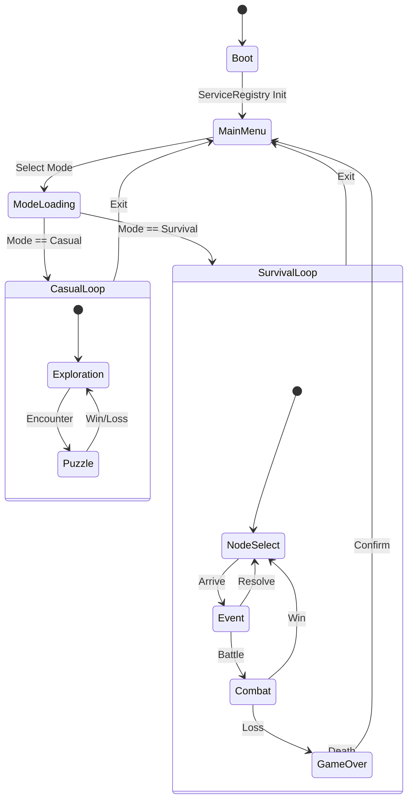

---
title: 徒踪游戏设计文档 (GDD)
version: 2.1.0
date: 2026-02-03
author: 徒踪设计团队
status: Approved
---

# 《徒踪》游戏设计文档 (GDD)

> 基于SDD（Specification Driven Development）原则编写的完整游戏设计文档

**文档版本：** v2.1.0  
**创建日期：** 2025-01-25 (最后更新: 2026-02-03)  
**文档作者：** 徒踪设计团队  
**文档状态：** 正式版  
**目标读者：** 所有开发人员、策划、美术、测试人员（初级开发人员可无障碍阅读）

---

## 📑 文档说明

### 文档目的
本文档是《徒踪》游戏的完整设计说明书，详细描述了游戏的所有核心机制、系统设计、UI/UX、音频设计和技术实现方案。所有开发人员（包括初级开发人员）都可以通过本文档完全理解游戏的每一个设计细节。

### 阅读指南
- **新成员必读章节**：第1章（游戏概述）、第2章（核心系统）、第3章（休闲探索模式）、第4章（生存挑战模式）
- **开发人员必读章节**：全部章节
- **美术人员必读章节**：第2章（核心系统）、第7章（UI/UX设计）
- **测试人员必读章节**：第2章（核心系统）、第6章（数值平衡）
- **音频人员必读章节**：第8章（音频设计）

### 文档结构
本文档共分为9个主要章节：
1. 游戏概述
2. 核心系统设计
3. 休闲探索模式详解
4. 生存挑战模式详解
5. 共享系统设计
6. 数值平衡与难度设计
7. UI/UX设计规范
8. 音频设计规范
9. 技术实施指南

---

## 📑 完整目录

1.  [第1章：游戏概述](#chapter1)
    *   1.1 游戏概念与目标
    *   1.2 目标用户分析
    *   1.3 游戏类型与平台
    *   1.4 开发基础信息
    *   1.5 设计哲学与原则

2.  [第2章：核心系统设计](#chapter2)
    *   2.1 双模式架构系统
    *   2.2 点击消除引擎
    *   2.3 卡牌系统
    *   2.4 路线节点系统
    *   2.5 资源与经济系统
    *   2.6 属性系统（生存模式）
    *   2.7 天气系统
    *   2.8 事件系统
    *   2.9 存档系统
    *   2.10 成就系统

3.  [第3章：休闲探索模式详解](#chapter3)
    *   3.1 模式设计理念
    *   3.2 完整游戏流程
    *   3.3 消除系统细节
    *   3.4 资源收集系统
    *   3.5 商店系统
    *   3.6 事件系统（轻松有趣）
    *   3.7 文化探索系统
    *   3.8 环保教育系统
    *   3.9 路线设计
    *   3.10 难度与平衡

4.  [第4章：生存挑战模式详解](#chapter4)
    *   4.1 模式设计理念
    *   4.2 完整游戏流程
    *   4.3 生存属性系统
    *   4.4 资源管理系统
    *   4.5 装备系统
    *   4.6 天气系统（硬核版）
    *   4.7 事件系统（生死攸关）
    *   4.8 危机系统
    *   4.9 路线设计
    *   4.10 死亡与重生系统

5.  [第5章：共享系统设计](#chapter5)
    *   5.1 跨模式数据同步
    *   5.2 共享货币系统
    *   5.3 共享图鉴系统
    *   5.4 共享成就系统
    *   5.5 协同机制设计

6.  [第6章：数值平衡与难度设计](#chapter6)
    *   6.1 核心数值公式
    *   6.2 休闲模式数值设计
    *   6.3 生存模式数值设计
    *   6.4 动态难度调整
    *   6.5 平衡性测试标准

7.  [第7章：UI/UX设计规范](#chapter7)
    *   7.1 界面层级结构
    *   7.2 主界面设计
    *   7.3 休闲模式界面设计
    *   7.4 生存模式界面设计
    *   7.5 通用UI组件
    *   7.6 交互设计规范
    *   7.7 动效设计规范

8.  [第8章：音频设计规范](#chapter8)
    *   8.1 音乐设计
    *   8.2 音效设计
    *   8.3 语音设计
    *   8.4 音频技术规范

9.  [第9章：技术实施指南](#chapter9)
    *   9.1 技术架构概览
    *   9.2 Godot 4.6实现方案
    *   9.3 性能优化策略
    *   9.4 测试方案
    *   9.5 发布计划

---

## <a name="chapter1"></a>第1章：游戏概述

### 1.1 游戏概念与目标

#### 1.1.1 高概念陈述（一句话描述）

**一款以中国地理文化与户外安全为背景的双模式策略游戏，通过休闲探索模式和生存挑战模式，让玩家在消除游戏中体验大湾区自然人文之美，在硬核生存中学习户外安全知识。**

#### 1.1.2 详细概念描述

《徒踪》是一款创新的双模式游戏，巧妙融合了休闲消除与硬核生存两种截然不同的体验：

**休闲探索模式**（湾区文化深度游）：
- 玩家通过爽快的点击消除，游历大湾区10条经典徒步路线
- 沿途收集风景照片卡，解锁地理文化知识
- 体验轻松愉快的环保教育，学习"无痕徒步"理念
- 适合所有年龄段玩家，是放松身心的理想选择

**生存挑战模式**（全国风险路线生存）：
- 玩家化身徒步者，挑战全国各大高风险徒步路线（如鳌太线、狼塔等）
- 管理体能、饥饿、口渴、体温、心率、心智六大核心属性
- 应对极端天气、突发危机、资源短缺等生死抉择
- 学习真实的户外生存技能与安全知识

**双模式的关联与价值**：
- 数据互通：共享货币、图鉴、成就
- 自然过渡：休闲模式积累资源可解锁生存模式装备
- 完整闭环：从"探索认知"到"风险教育"，形成完整的教育体验

#### 1.1.3 核心设计目标

**目标1：提供纯粹且双轨的体验**
- 两种模式在玩法、节奏、氛围上完全独立
- 休闲模式玩家永远不必面对生存压力
- 生存模式玩家永远不必处理文化探索任务

**目标2：实现"玩中学"的教育价值**
- 通过游戏机制自然融入地理文化与户外安全知识
- 避免显性说教，让玩家在不知不觉中学习
- 提供真实的户外案例，增强教育效果

**目标3：创造可持续的玩法循环**
- 通过收集系统激发探索欲
- 通过成就系统提供长期目标
- 通过双模式切换调节游戏节奏，避免疲劳

**目标4：保证真实性与可玩性的平衡**
- 所有路线、地理、气候数据基于真实资料
- 所有事件、风险对应户外真实情境
- 游戏性调整以不牺牲真实性为前提

### 1.2 目标用户分析

#### 1.2.1 用户画像矩阵

| 用户类型 | 年龄段 | 推荐模式 | 核心需求 | 游戏时长 |
| :--- | :--- | :--- | :--- | :--- |
| **都市白领** | 28-35岁 | 休闲为主，生存为辅 | 快速解压、文化探索 | 10-15分钟/次 |
| **户外爱好者** | 25-45岁 | 生存为主，休闲为辅 | 真实风险、安全知识 | 20-30分钟/次 |
| **青少年学生** | 12-18岁 | 休闲优先，生存需引导 | 学习地理、户外入门 | 5-10分钟/次 |
| **教育工作者** | 30-50岁 | 双模式结合 | 教学辅助、案例丰富 | 不定 |
| **大湾区居民** | 20-50岁 | 休闲探索 | 文化认同、本地探索 | 10-15分钟/次 |

#### 1.2.2 用户需求详细分析

**都市白领（28-35岁，休闲模式主力）**
- **需求描述**：工作压力大，需要快速解压的游戏；对大湾区文化有好奇；偶尔想挑战硬核内容
- **使用场景**：通勤路上玩2关休闲模式；周末挑战一次生存模式
- **设计响应**：提供流畅的消除操作、快速的关卡节奏、丰富的文化内容

**户外爱好者（25-45岁，生存模式主力）**
- **需求描述**：对真实户外风险感兴趣；希望学习安全知识；想收集所有路线装备
- **使用场景**：主要玩生存模式；用休闲模式积累资源
- **设计响应**：提供真实的风险数据、详细的生存机制、硬核的决策体验

**青少年学生（12-18岁，休闲模式优先）**
- **需求描述**：通过游戏学习地理文化；对户外安全有基础认知；喜欢收集与成就
- **使用场景**：课堂上老师引导玩休闲模式；家庭活动时尝试生存模式
- **设计响应**：提供易懂的知识传递、适度的挑战、丰富的收集要素

### 1.3 游戏类型与平台

#### 1.3.1 游戏类型定义

**主类型**：休闲消除 + 生存模拟

**子类型**：
- 休闲探索模式：点击消除、卡牌收集、文化探索
- 生存挑战模式：资源管理、策略游戏、轻Roguelike

#### 1.3.2 目标平台

**首发平台**：PC (Windows)

**目标平台**：
- PC: Windows 10/11

#### 1.3.3 性能目标

| 指标 | 目标值 | 说明 |
| :--- | :--- | :--- |
| 帧率 | 60 FPS | 稳定帧率，确保流畅体验 |
| 加载时间 | ≤3秒 | 冷启动时间 |
| 内存占用 | ≤1GB | 目标设备 |
| 安装包大小 | ≤500MB | PC版本 |


### 1.4 开发基础信息

#### 1.4.1 技术栈

- **游戏引擎**：Godot 4.6
- **脚本语言**：GDScript（主要）、C# 12.0（性能关键模块）
- **数据存储**：JSON + AES加密
- **音频格式**：Ogg Vorbis
- **图像格式**：PNG（透明）、WebP（压缩）

#### 1.4.2 开发周期

- **P0阶段**：技术架构搭建、核心系统开发
- **P1阶段**：休闲探索模式完整实现
- **P2阶段**：生存挑战模式完整实现
- **P3阶段**：双模式集成、测试优化
- **P4阶段**：发布

#### 1.4.3 团队规模

- **策划**：2人
- **开发**：4人
- **美术**：3人
- **音频**：1人
- **测试**：2人

### 1.5 设计哲学与原则

#### 1.5.1 四大核心原则

**原则1：模式独立，体验纯粹**
- 两种模式在玩法节奏、UI界面、音乐氛围上完全独立
- 避免交叉干扰，让玩家在每种模式下都能获得沉浸体验

**原则2：数据互通，自然过渡**
- 共享货币系统："徒步数"（通用）、"海拔数"（通用）
- 共享图鉴系统：照片卡、装备在两种模式下均可收集
- 共享成就系统：部分成就需要两种模式协作解锁

**原则3：教育分层，各司其职**
- 休闲模式：负责文化探索与环保教育（"知其然"）
- 生存模式：负责安全知识与风险认知（"知其所以然"）
- 通过真实案例连接两种教育，形成完整认知闭环

**原则4：真实性是根本**
- 所有路线、地理、气候数据基于真实资料
- 所有事件、风险、后果严格对应户外真实情境
- 坚决杜绝为了游戏性而牺牲真实性的设计

#### 1.5.2 设计决策记录（ADR）

**ADR-001：为什么选择双模式而非单一模式？**
- **背景**：传统游戏常面临"休闲玩家嫌难、硬核玩家嫌浅"的两难困境
- **决策**：采用双模式架构，完全分离两种体验
- **后果**：开发成本增加，但能同时满足两类玩家需求，扩大受众范围

**ADR-002：为什么选择消除作为核心玩法？**
- **背景**：需要一种普适性强、易于上手的核心机制
- **决策**：采用点击消除，通过参数调整实现双模式差异
- **后果**：开发难度适中，易于扩展，且两种模式可共享核心引擎

**ADR-003：为什么选择大湾区作为休闲模式背景？**
- **背景**：需要一个地理范围适中、文化丰富的区域
- **决策**：选择大湾区，涵盖香港、澳门、广东9市
- **后果**：内容素材丰富，易于本地化，有政策支持

---

## <a name="chapter2"></a>第2章：核心系统设计

### 2.1 双模式架构系统

#### 2.1.1 架构概览

```
┌─────────────────────────────────────────────────────┐
│                   《徒踪》双模式架构                   │
├─────────────────────────────────────────────────────┤
│                                                       │
│  ┌─────────────────────┐    ┌─────────────────────┐  │
│  │   休闲探索模式       │    │   生存挑战模式       │  │
│  │   (Casual Mode)     │    │  (Survival Mode)    │  │
│  └─────────────────────┘    └─────────────────────┘  │
│            │                          │              │
│            └──────────┬───────────────┘              │
│                       │                              │
│        ┌──────────────▼──────────────┐               │
│        │     共享核心引擎层           │               │
│        │  (Shared Core Engine)       │               │
│        │  - 点击消除引擎            │               │
│        │  - 卡牌系统                │               │
│        │  - 资源系统                │               │
│        │  - 事件系统                │               │
│        │  - 存档系统                │               │
│        └──────────┬──────────────────┘               │
│                   │                                  │
│        ┌──────────▼──────────────────┐               │
│        │      数据共享层              │               │
│        │   (Data Sharing Layer)      │               │
│        │  - 共享货币                │               │
│        │  - 共享图鉴                │               │
│        │  - 共享成就                │               │
│        └─────────────────────────────┘               │
│                                                       │
└─────────────────────────────────────────────────────┘
```

#### 2.1.2 双模式架构详细图

```
┌─────────────────────────────────────────────────────────────────────────────┐
│                        《徒踪》双模式架构详细图                                  │
├─────────────────────────────────────────────────────────────────────────────┤
│                                                                              │
│  ┌──────────────────────────────────┐      ┌──────────────────────────────────┐│
│  │      休闲探索模式 (Casual)       │      │      生存挑战模式 (Survival)      ││
│  │                                 │      │                                 ││
│  │  ┌─────────────────────────┐    │      │  ┌─────────────────────────┐    ││
│  │  │  消除游戏玩法层         │    │      │  │  生存管理玩法层         │    ││
│  │  │  - 卡牌消除              │    │      │  │  - 属性管理              │    ││
│  │  │  - Combo系统             │    │      │  │  - 资源管理              │    ││
│  │  │  - 特殊消除              │    │      │  │  - 装备管理              │    ││
│  │  │  - 得分系统              │    │      │  │  - 决策系统              │    ││
│  │  └─────────┬───────────────┘    │      │  └─────────┬───────────────┘    ││
│  │            │                      │      │            │                      ││
│  │  ┌─────────▼───────────────┐    │      │  ┌─────────▼───────────────┐    ││
│  │  │  休闲特定系统层         │    │      │  │  生存特定系统层         │    ││
│  │  │  - 文化探索系统         │    │      │  │  - 危机系统              │    ││
│  │  │  - 环保教育系统         │    │      │  │  - 天气系统（硬核）     │    ││
│  │  │  - 轻松事件系统         │    │      │  │  - 死亡/重生系统         │    ││
│  │  └─────────┬───────────────┘    │      │  └─────────┬───────────────┘    ││
│  │            │                      │      │            │                      ││
│  └────────────┼──────────────────────┘      └────────────┼──────────────────────┘│
│               │                                      │                           │
│               └──────────────┬───────────────────────┘                           │
│                              │                                                  │
│         ┌────────────────────▼──────────────────────┐                           │
│         │           共享核心引擎层                  │                           │
│         │  ┌──────────────────────────────────┐    │                           │
│         │  │  点击消除引擎                    │    │                           │
│         │  │  - 消除算法                      │    │                           │
│         │  │  - 连锁反应                      │    │                           │
│         │  │  - 特殊效果                      │    │                           │
│         │  └──────────────────────────────────┘    │                           │
│         │  ┌──────────────────────────────────┐    │                           │
│         │  │  卡牌系统                        │    │                           │
│         │  │  - 卡牌数据管理                  │    │                           │
│         │  │  - 卡牌渲染                      │    │                           │
│         │  │  - 卡牌动画                      │    │                           │
│         │  └──────────────────────────────────┘    │                           │
│         │  ┌──────────────────────────────────┐    │                           │
│         │  │  路线节点系统                    │    │                           │
│         │  │  - 节点定义                      │    │                           │
│         │  │  - 节点导航                      │    │                           │
│         │  │  - 节点事件                      │    │                           │
│         │  └──────────────────────────────────┘    │                           │
│         │  ┌──────────────────────────────────┐    │                           │
│         │  │  事件系统                        │    │                           │
│         │  │  - 事件定义                      │    │                           │
│         │  │  - 事件触发                      │    │                           │
│         │  │  - 事件处理                      │    │                           │
│         │  └──────────────────────────────────┘    │                           │
│         │  ┌──────────────────────────────────┐    │                           │
│         │  │  存档系统                        │    │                           │
│         │  │  - 自动存档                      │    │                           │
│         │  │  - 手动存档                      │    │                           │
│         │  │  - 存档加密                      │    │                           │
│         │  └──────────────────────────────────┘    │                           │
│         └──────────────────┬─────────────────────┘                           │
│                            │                                                     │
│         ┌──────────────────▼─────────────────────┐                           │
│         │              数据共享层                 │                           │
│         │  ┌──────────────────────────────────┐    │                           │
│         │  │  共享货币系统                    │    │                           │
│         │  │  - 徒步数                        │    │                           │
│         │  │  - 海拔数                        │    │                           │
│         │  └──────────────────────────────────┘    │                           │
│         │  ┌──────────────────────────────────┐    │                           │
│         │  │  共享图鉴系统                    │    │                           │
│         │  │  - 照片卡                        │    │                           │
│         │  │  - 装备图鉴                      │    │                           │
│         │  └──────────────────────────────────┘    │                           │
│         │  ┌──────────────────────────────────┐    │                           │
│         │  │  共享成就系统                    │    │                           │
│         │  │  - 成就定义                      │    │                           │
│         │  │  - 成就进度                      │    │                           │
│         │  └──────────────────────────────────┘    │                           │
│         └──────────────────┬─────────────────────┘                           │
│                            │                                                     │
│         ┌──────────────────▼─────────────────────┐                           │
│         │            平台抽象层                   │                           │
│         │  ┌──────────────────────────────────┐    │                           │
│         │  │  Godot 4.6 引擎                  │    │                           │
│         │  └──────────────────────────────────┘    │                           │
│         └─────────────────────────────────────┘                           │
│                                                                              │
└─────────────────────────────────────────────────────────────────────────────┘
```


#### 2.1.3 数据流向图

```
┌─────────────────────────────────────────────────────────────────────────────┐
│                           双模式数据流向图                                     │
├─────────────────────────────────────────────────────────────────────────────┤
│                                                                              │
│  休闲模式                          共享层                          生存模式   │
│                                                                              │
│  ┌──────────┐  同步     ┌──────────────┐   同步     ┌──────────┐            │
│  │ 徒步数   │◄────────►│  共享货币    │◄────────►│ 徒步数   │            │
│  │ +100     │           │  - 徒步数    │           │ +150     │            │
│  └──────────┘           │  - 海拔数    │           └──────────┘            │
│                         └──────┬───────┘                                      │
│                                │                                             │
│  ┌──────────┐  同步     ┌──────▼───────┐   同步     ┌──────────┐            │
│  │ 海拔数   │◄────────►│  共享图鉴    │◄────────►│ 装备图鉴  │            │
│  │ +50      │           │  - 照片卡    │           │ +1       │            │
│  └──────────┘           │  - 装备图鉴  │           └──────────┘            │
│                         └──────┬───────┘                                      │
│                                │                                             │
│  ┌──────────┐  同步     ┌──────▼───────┐   同步     ┌──────────┐            │
│  │ 成就     │◄────────►│  共享成就    │◄────────►│ 成就     │            │
│  │ "文化探索"│         │  - 成就进度  │           │ "生存专家"│            │
│  └──────────┘           └─────────────┘           └──────────┘            │
│                                                                              │
│                              数据同步时机                                      │
│                                                                              │
│  1. 模式切换时自动同步         2. 关卡通关后自动同步                             │
│  3. 游戏退出前自动同步         4. 定时自动同步（每5分钟）                        │
│                                                                              │
└─────────────────────────────────────────────────────────────────────────────┘
```

#### 2.1.4 接口定义图

```
┌─────────────────────────────────────────────────────────────────────────────┐
│                          双模式接口定义图                                       │
├─────────────────────────────────────────────────────────────────────────────┤
│                                                                              │
│  ┌──────────────────────────────────────────────────────────────────────┐  │
│  │                         模式管理器 (ModeManager)                       │  │
│  │                                                                      │  │
│  │  ┌────────────────────────────────────────────────────────────┐     │  │
│  │  │ 接口: switch_mode(new_mode: GameMode) -> bool              │     │  │
│  │  │     功能: 切换游戏模式                                        │     │  │
│  │  │     参数: new_mode - 目标模式                                 │     │  │
│  │  │     返回: 成功返回true，否则返回false                         │     │  │
│  │  └────────────────────────────────────────────────────────────┘     │  │
│  │                                                                      │  │
│  │  ┌────────────────────────────────────────────────────────────┐     │  │
│  │  │ 接口: sync_shared_data() -> void                            │     │  │
│  │  │     功能: 同步跨模式数据                                      │     │  │
│  │  │     参数: 无                                                 │     │  │
│  │  │     返回: 无                                                 │     │  │
│  │  └────────────────────────────────────────────────────────────┘     │  │
│  │                                                                      │  │
│  │  ┌────────────────────────────────────────────────────────────┐     │  │
│  │  │ 接口: can_switch_mode() -> bool                             │     │  │
│  │  │     功能: 检查是否可以切换模式                                │     │  │
│  │  │     参数: 无                                                 │     │  │
│  │  │     返回: 可以切换返回true，否则返回false                     │     │  │
│  │  └────────────────────────────────────────────────────────────┘     │  │
│  └──────────────────────────────────────────────────────────────────────┘  │
│                                                                              │
│  ┌──────────────────────────────────────────────────────────────────────┐  │
│  │                     数据管理器 (DataManager)                          │  │
│  │                                                                      │  │
│  │  ┌────────────────────────────────────────────────────────────┐     │  │
│  │  │ 接口: get_currency_data() -> Dictionary                      │     │  │
│  │  │     功能: 获取货币数据                                        │     │  │
│  │  └────────────────────────────────────────────────────────────┘     │  │
│  │                                                                      │  │
│  │  ┌────────────────────────────────────────────────────────────┐     │  │
│  │  │ 接口: get_collection_data() -> Dictionary                    │     │  │
│  │  │     功能: 获取图鉴数据                                        │     │  │
│  │  └────────────────────────────────────────────────────────────┘     │  │
│  │                                                                      │  │
│  │  ┌────────────────────────────────────────────────────────────┐     │  │
│  │  │ 接口: get_achievements_data() -> Array                       │     │  │
│  │  │     功能: 获取成就数据                                        │     │  │
│  │  └────────────────────────────────────────────────────────────┘     │  │
│  └──────────────────────────────────────────────────────────────────────┘  │
│                                                                              │
│  ┌──────────────────────────────────────────────────────────────────────┐  │
│  │                    事件系统 (EventManager)                             │  │
│  │                                                                      │  │
│  │  ┌────────────────────────────────────────────────────────────┐     │  │
│  │  │ 接口: trigger_event(event_id: String) -> void                │     │  │
│  │  │     功能: 触发指定事件                                        │     │  │
│  │  └────────────────────────────────────────────────────────────┘     │  │
│  │                                                                      │  │
│  │  ┌────────────────────────────────────────────────────────────┐     │  │
│  │  │ 接口: handle_choice(choice_id: int) -> void                 │     │  │
│  │  │     功能: 处理玩家选择的选项                                  │     │  │
│  │  └────────────────────────────────────────────────────────────┘     │  │
│  └──────────────────────────────────────────────────────────────────────┘  │
│                                                                              │
└─────────────────────────────────────────────────────────────────────────────┘
```

#### 2.1.5 模式管理器设计

**类名**：`ModeManager`

**职责**：
- 管理当前游戏模式
- 处理模式切换逻辑
- 同步跨模式数据
- 检测模式切换条件

**核心接口**：

```gdscript
## 游戏模式枚举
enum GameMode {
    MODE_CASUAL,      # 休闲探索模式
    MODE_SURVIVAL     # 生存挑战模式
}

## 当前模式
var current_mode: GameMode = GameMode.MODE_CASUAL

## 切换模式
##
## 参数:
##     new_mode: 目标模式
##
## 返回:
##     切换成功返回true，否则返回false
func switch_mode(new_mode: GameMode) -> bool:
    pass

## 同步跨模式数据
##
## 将当前模式的共享数据同步到全局存储
func sync_shared_data() -> void:
    pass

## 检查是否可以切换模式
##
## 返回:
##     可以切换返回true，否则返回false
func can_switch_mode() -> bool:
    pass
```

### 2.2 点击消除引擎

#### 2.2.1 消除系统基础机制

**工作流程**：
```
玩家点击卡牌 → 检查是否可点击 → 播放消除动画 → 
触发消除效果 → 检查连锁反应 → 更新得分 → 
检查特殊消除 → 检查Combo → 播放反馈音效
```

**核心算法**：

**步骤1：可点击检测**
```
对于每张卡牌：
  IF 卡牌未被遮挡 AND 卡牌未锁定 THEN
    卡牌可点击 = True
  ELSE
    卡牌可点击 = False
  END IF
END FOR
```

**步骤2：消除处理**
```
对于被点击的卡牌：
  1. 标记为"已消除"
  2. 播放消除动画（粒子效果）
  3. 更新得分 = 基础得分 × Combo倍率
  4. 触发卡牌特效（如果有）
  5. 检查连锁反应
END FOR
```

**步骤3：连锁反应检测**
```
对于每张"已消除"卡牌的相邻卡牌：
  IF 相邻卡牌与消除卡牌类型相同 THEN
    将相邻卡牌加入"待消除队列"
  END IF
END FOR
```

#### 2.2.1.1 消除系统详细流程图

```
┌─────────────────────────────────────────────────────────────────────────────┐
│                           消除系统完整流程图                                    │
├─────────────────────────────────────────────────────────────────────────────┤
│                                                                              │
│  开始                                                                         │
│   │                                                                          │
│   ▼                                                                          │
│  ┌──────────────┐                                                            │
│  │  等待玩家点击  │                                                            │
│  └──────┬───────┘                                                            │
│         │                                                                     │
│         ▼                                                                     │
│  ┌──────────────┐         NO                                                 │
│  │ 检查是否可点击│◄──────────────┐                                            │
│  └──────┬───────┘               │                                            │
│         │ YES                    │                                            │
│         ▼                        │                                            │
│  ┌──────────────┐                                                            │
│  │ 播放点击反馈  │                                                            │
│  └──────┬───────┘                                                            │
│         │                                                                     │
│         ▼                                                                     │
│  ┌──────────────┐                                                            │
│  │ 标记为"已消除"│                                                            │
│  └──────┬───────┘                                                            │
│         │                                                                     │
│         ▼                                                                     │
│  ┌──────────────┐                                                            │
│  │ 播放消除动画  │                                                            │
│  │ (粒子效果)   │                                                            │
│  └──────┬───────┘                                                            │
│         │                                                                     │
│         ▼                                                                     │
│  ┌──────────────┐                                                            │
│  │ 触发卡牌特效  │                                                            │
│  │ (如果有)     │                                                            │
│  └──────┬───────┘                                                            │
│         │                                                                     │
│         ▼                                                                     │
│  ┌──────────────┐                                                            │
│  │ 更新得分     │                                                            │
│  │ = 基础得分   │                                                            │
│  │   × Combo倍率│                                                           │
│  └──────┬───────┘                                                            │
│         │                                                                     │
│         ▼                                                                     │
│  ┌──────────────────┐     YES     ┌──────────────────┐                       │
│  │ 检查连锁反应      │──────────►│ 将相邻同类卡牌加入  │                       │
│  │ (检查相邻卡牌)    │            │ 待消除队列         │                       │
│  └──────┬───────────┘            └────────┬─────────┘                       │
│         │ NO                                 │                                 │
│         ▼                                   │                                 │
│  ┌──────────────┐                           │                                 │
│  │ 检查Combo    │                           │                                 │
│  └──────┬───────┘                           │                                 │
│         │                                   │                                 │
│         ▼                                   │                                 │
│  ┌──────────────────┐   YES    ┌──────────────────┐                         │
│  │ 连续消除≤3秒?    │────────►│ Combo+1          │                         │
│  └──────┬───────────┘         └────────┬─────────┘                         │
│         │ NO                           │                                     │
│         ▼                             │                                     │
│  ┌──────────────┐                      │                                     │
│  │ Combo重置为0  │                      │                                     │
│  └──────┬───────┘                      │                                     │
│         │                               │                                     │
│         └───────────┬───────────────────┘                                     │
│                     ▼                                                     │
│             ┌──────────────┐                                                │
│             │ 播放反馈音效  │                                                │
│             └──────┬───────┘                                                │
│                    │                                                        │
│                    ▼                                                        │
│             ┌──────────────┐     YES                                         │
│             │ 待消除队列    │──────────────────────────────┐                 │
│             │ 为空?        │                              │                 │
│             └──────┬───────┘                              │                 │
│                    │ NO                                   │                 │
│                    ▼                                      │                 │
│             ┌──────────────┐                              │                 │
│             │ 处理下一个卡牌  │◄─────────────────────────────┘                 │
│             └──────────────┘                                                │
│                    │                                                        │
│                    ▼                                                        │
│             ┌──────────────┐     YES     ┌──────────────┐                     │
│             │ 检查关卡完成  │──────────►│ 关卡完成     │                     │
│             └──────┬───────┘            └──────┬───────┘                     │
│                    │ NO                           │                           │
│                    └──────────┬────────────────────┘                           │
│                               │                                                │
│                               ▼                                                │
│                        ┌──────────────┐                                       │
│                        │ 返回等待状态  │                                       │
│                        └──────┬───────┘                                       │
│                               │                                                │
│                               │                                                │
│                               └─────────────────────────────────────────────┘
│                                                                              │
└─────────────────────────────────────────────────────────────────────────────┘
```

**流程说明**：

1. **等待玩家点击**：系统进入等待状态，监听玩家的点击事件

2. **检查是否可点击**：
   - 卡牌未被遮挡（没有其他卡牌覆盖在上面）
   - 卡牌未被锁定（未被特殊效果锁定）
   - 如果不可点击，返回等待状态

3. **播放点击反馈**：播放点击音效和视觉反馈

4. **标记为"已消除"**：将卡牌标记为待消除状态

5. **播放消除动画**：播放粒子效果、缩放动画等

6. **触发卡牌特效**：如果卡牌有特殊效果（如炸弹、闪电），触发相应特效

7. **更新得分**：
   - 基础得分 × Combo倍率
   - 更新屏幕上的得分显示

8. **检查连锁反应**：
   - 检查消除卡牌的上下左右相邻卡牌
   - 如果相邻卡牌与消除卡牌类型相同，加入待消除队列
   - 如果有待消除卡牌，处理下一个卡牌

9. **检查Combo**：
   - 如果连续两次消除时间间隔 ≤ 3秒，Combo+1
   - 否则Combo重置为0

10. **播放反馈音效**：根据Combo等级播放不同的音效

11. **检查关卡完成**：
    - 如果所有卡牌都被消除，关卡完成
    - 否则，返回等待状态

#### 2.2.2 Combo系统

**Combo触发条件**：
- 两次消除之间的时间间隔 ≤ 3秒
- Combo从2次消除开始计数（第2次消除触发Combo × 2）

**Combo倍率计算**：

| 连续消除次数 | Combo倍率 | 特殊效果 |
| :--- | :--- | :--- |
| 1次 | 1.0 | 无 |
| 2-3次 | 1.5 | 基础光效 |
| 4-5次 | 2.0 | 屏幕震动 |
| 6-7次 | 3.0 | 粒子爆炸 |
| 8次以上 | 5.0 | 全屏特效 |

**Combo中断条件**：
- 连续2秒未进行任何消除操作
- 玩家手动暂停游戏
- 关卡结束

#### 2.2.3 模式差异参数

| 参数 | 休闲探索模式 | 生存挑战模式 |
| :--- | :--- | :--- |
| **点击响应延迟** | ≤0.1秒 | ≤0.2秒 |
| **消除动画时长** | 0.3秒 | 0.5秒 |
| **Combo倍率** | 最高5.0倍 | 最高2.0倍 |
| **连锁触发阈值** | 3张同类卡牌 | 5张同类卡牌 |
| **特殊消除概率** | 20% | 10% |

### 2.3 卡牌系统

#### 2.3.1 卡牌数据结构

**CardData类定义**：

```gdscript
## 卡牌数据类
class CardData:
    var id: String                    # 卡牌唯一ID
    var name: String                  # 卡牌名称
    var type: CardType                # 卡牌类型
    var rarity: CardRarity            # 稀有度
    var description: String           # 描述
    var texture_path: String          # 纹理路径
    var effect_data: Dictionary       # 效果数据
    var value: int                    # 基础值（得分/属性值）
    var tags: Array                   # 标签
    
    ## 初始化
    func _init(p_id: String, p_name: String, p_type: CardType, p_rarity: CardRarity):
        id = p_id
        name = p_name
        type = p_type
        rarity = p_rarity
        description = ""
        texture_path = ""
        effect_data = {}
        value = 10
        tags = []
    
    ## 验证数据完整性
    func validate() -> bool:
        return not id.is_empty() and not name.is_empty()
    
    ## 转换为字典
    func to_dict() -> Dictionary:
        return {
            "id": id,
            "name": name,
            "type": type,
            "rarity": rarity,
            "description": description,
            "texture_path": texture_path,
            "effect_data": effect_data,
            "value": value,
            "tags": tags
        }
    
    ## 从字典创建
    static func from_dict(data: Dictionary) -> CardData:
        var card_data = CardData.new(
            data.get("id", ""),
            data.get("name", ""),
            data.get("type", CardType.SPECIAL),
            data.get("rarity", CardRarity.COMMON)
        )
        card_data.description = data.get("description", "")
        card_data.texture_path = data.get("texture_path", "")
        card_data.effect_data = data.get("effect_data", {})
        card_data.value = data.get("value", 10)
        card_data.tags = data.get("tags", [])
        return card_data
```

#### 2.3.2 卡牌类型定义

**CardType枚举**：

```gdscript
## 卡牌类型
enum CardType {
    SCENERY,          # 风景卡
    ENVIRONMENT,      # 环境卡
    RESOURCE,         # 资源卡
    EQUIPMENT,        # 装备卡
    EVENT,            # 事件卡
    SPECIAL           # 特殊卡
}
```

**CardRarity枚举**：

```gdscript
## 卡牌稀有度
enum CardRarity {
    COMMON,           # 普通（白色）
    RARE,             # 稀有（蓝色）
    EPIC,             # 珍贵（紫色）
    LEGENDARY         # 传奇（金色）
}
```

#### 2.3.3 卡牌视觉效果

**普通卡牌（白色）**：
- 边框：白色细边框
- 背景：浅灰色渐变
- 文字：黑色

**稀有卡牌（蓝色）**：
- 边框：蓝色发光边框
- 背景：浅蓝色渐变
- 文字：深蓝色
- 特效：轻微光晕

**珍贵卡牌（紫色）**：
- 边框：紫色发光边框
- 背景：浅紫色渐变
- 文字：深紫色
- 特效：光晕+粒子

**传奇卡牌（金色）**：
- 边框：金色发光边框
- 背景：金黄色渐变
- 文字：深金色
- 特效：全屏闪光

#### 2.3.4 模式差异卡牌设计

**休闲探索模式卡牌特点**：
- **视觉**：彩绘铅笔画风格，色彩鲜明
- **内容**：大湾区景观、文化、环保主题
- **功能**：主要提供得分和收集价值
- **效果**：以视觉特效为主，策略性较弱

**生存挑战模式卡牌特点**：
- **视觉**：写实风格，色调偏冷
- **内容**：真实物资、天气、危机事件
- **功能**：直接关联生存属性
- **效果**：以策略效果为主，影响属性值

### 2.4 路线节点系统

#### 2.4.1 节点类型定义

**RouteNode枚举**：

```gdscript
## 路线节点类型
enum RouteNodeType {
    START,           # 起点
    NORMAL,          # 常规路段
    REST,            # 休息点
    SUPPLY,          # 补给点
    DANGER,          # 危险点（生存模式）
    VIEWPOINT,       # 观景点（休闲模式）
    CULTURE,         # 文化点（休闲模式）
    END              # 终点
}
```

#### 2.4.2 节点数据结构

**RouteNodeData类定义**：

```gdscript
## 路线节点数据类
class RouteNodeData:
    var id: String                    # 节点ID
    var name: String                  # 节点名称
    var type: RouteNodeType           # 节点类型
    var position: Vector2             # 在地图上的位置
    var description: String           # 节点描述
    var requirements: Dictionary      # 通过要求（装备/属性）
    var rewards: Dictionary           # 通关奖励
    var events: Array                 # 可触发的事件列表
    var connections: Array            # 连接的下一节点ID列表
    
    ## 初始化
    func _init(p_id: String, p_name: String, p_type: RouteNodeType):
        id = p_id
        name = p_name
        type = p_type
        position = Vector2.ZERO
        description = ""
        requirements = {}
        rewards = {}
        events = []
        connections = []
```

#### 2.4.3 路线数据结构

**RouteData类定义**：

```gdscript
## 路线数据类
class RouteData:
    var id: String                    # 路线ID
    var name: String                  # 路线名称
    var region: String                # 所属区域
    var mode: GameMode                # 适用模式
    var difficulty: int               # 难度（1-10）
    var total_distance: float         # 总距离（公里）
    var estimated_time: float         # 预计时间（小时）
    var nodes: Array                  # 节点列表
    var requirements: Dictionary      # 解锁要求
    var rewards: Dictionary           # 通关奖励
    
    ## 初始化
    func _init(p_id: String, p_name: String, p_region: String, p_mode: GameMode):
        id = p_id
        name = p_name
        region = p_region
        mode = p_mode
        difficulty = 1
        total_distance = 0.0
        estimated_time = 0.0
        nodes = []
        requirements = {}
        rewards = {}
```

### 2.5 资源与经济系统

#### 2.5.1 共享货币系统

**货币类型**：

| 货币 | 名称 | 用途 | 获取方式 |
| :--- | :--- | :--- | :--- |
| **徒步数** | 徒步数 | 通用货币，购买基础物品 | 两种模式通关均可获得 |
| **海拔数** | 海拔数 | 高级货币，购买高级物品 | 生存模式获得更多 |

**货币数据存储**：

```gdscript
## 玩家货币数据
class PlayerCurrencyData:
    var trekking_points: int = 0      # 徒步数
    var altitude_points: int = 0      # 海拔数
    
    ## 增加徒步数
    func add_trekking_points(amount: int) -> void:
        trekking_points += amount
    
    ## 增加海拔数
    func add_altitude_points(amount: int) -> void:
        altitude_points += amount
    
    ## 转换为字典
    func to_dict() -> Dictionary:
        return {
            "trekking_points": trekking_points,
            "altitude_points": altitude_points
        }
    
    ## 从字典创建
    static func from_dict(data: Dictionary) -> PlayerCurrencyData:
        var currency_data = PlayerCurrencyData.new()
        currency_data.trekking_points = data.get("trekking_points", 0)
        currency_data.altitude_points = data.get("altitude_points", 0)
        return currency_data
```

### 2.6 属性系统（生存模式）

#### 2.6.1 属性定义

**六大核心属性**：

| 属性 | 名称 | 正常范围 | 危险阈值 | 致命阈值 | 恢复方式 |
| :--- | :--- | :--- | :--- | :--- | :--- |
| **体能** | Stamina | 80-100 | <50 | =0 | 休息、食物 |
| **饥饿** | Hunger | 0-20 | >50 | =100 | 食物 |
| **口渴** | Thirst | 0-20 | >50 | =100 | 饮水 |
| **体温** | Temperature | 36-37°C | <35°C 或 >39°C | <30°C 或 >42°C | 防寒/防暑装备 |
| **心率** | HeartRate | 60-100 | >120 | >150 | 休息、药物 |
| **心智** | Mental | 80-100 | <50 | =0 | 休息、娱乐 |

**属性数据结构**：

```gdscript
## 生存属性数据类
class SurvivalStatsData:
    var stamina: float = 100.0       # 体能
    var hunger: float = 0.0          # 饥饿（0=不饿，100=极度饥饿）
    var thirst: float = 0.0          # 口渴（0=不渴，100=极度口渴）
    var temperature: float = 36.5    # 体温（摄氏度）
    var heart_rate: int = 70         # 心率（次/分钟）
    var mental: float = 100.0        # 心智（精神状态）
    
    ## 检查是否存活
    func is_alive() -> bool:
        if stamina <= 0:
            return false
        if hunger >= 100:
            return false
        if thirst >= 100:
            return false
        if temperature < 30 or temperature > 42:
            return false
        if heart_rate > 150:
            return false
        if mental <= 0:
            return false
        return true
    
    ## 获取生存状态
    func get_status() -> String:
        if not is_alive():
            return "DEAD"
        if stamina < 50 or hunger > 50 or thirst > 50:
            return "CRITICAL"
        if stamina < 80 or hunger > 20 or thirst > 20:
            return "WARNING"
        return "NORMAL"
```

### 2.7 天气系统

#### 2.7.1 天气类型定义

**WeatherType枚举**：

```gdscript
## 天气类型
enum WeatherType {
    SUNNY,           # 晴天
    CLOUDY,          # 多云
    RAINY,           # 雨天
    SNOWY,           # 雪天
    FOGGY,           # 雾天
    STORM,           # 暴风雨
    HEATWAVE,        # 热浪
    COLDWAVE         # 寒潮
}
```

#### 2.7.2 天气效果数据

**WeatherEffectData类定义**：

```gdscript
## 天气效果数据类
class WeatherEffectData:
    var weather_type: WeatherType     # 天气类型
    var name: String                  # 天气名称
    var description: String           # 描述
    
    ## 对属性的影响
    var stamina_modifier: float = 1.0       # 体能消耗修正（倍率）
    var hunger_modifier: float = 1.0        # 饥饿增加修正（倍率）
    var thirst_modifier: float = 1.0        # 口渴增加修正（倍率）
    var temperature_modifier: float = 0.0   # 体温修正（摄氏度）
    var heart_rate_modifier: int = 0        # 心率修正（次/分钟）
    var mental_modifier: float = 0.0        # 心智修正（直接值）
    
    ## 对玩法的影响
    var visibility: float = 1.0        # 可见度（0-1）
    var movement_speed: float = 1.0    # 移动速度（倍率）
    var event_chance_modifier: float = 1.0  # 事件概率修正（倍率）
```

#### 2.7.3 天气对游戏的影响

**晴天（SUNNY）**：
- 体能消耗：1.0（正常）
- 心智：+5/分钟
- 可见度：1.0（极佳）
- 事件概率：1.0（正常）

**雨天（RAINY）**：
- 体能消耗：1.2（+20%）
- 体温：-0.5°C/10分钟
- 可见度：0.6（降低）
- 滑倒概率：20%

**暴风雨（STORM）**：
- 体能消耗：1.5（+50%）
- 心率：+10次/分钟
- 体温：-1.0°C/10分钟
- 可见度：0.3（极低）
- 失温概率：40%
- 事件概率：2.0（翻倍）

**回南天（HUINANTIAN）**：
- 体能消耗：1.3（+30%）
- 体温：+0.2°C/回合（湿热效应）
- 心智：-5/回合（闷热烦躁）
- 可见度：0.5（降低）
- 装备效果：-20%（装备受潮）
- 滑倒概率：+20%（地面湿滑）
- 应对策略：使用防潮剂，避免户外活动

休闲模式中的应用：
- 卡牌视觉效果：卡牌表面有水珠特效
- 背景音效：淅沥的雨滴声
- 文化知识：介绍回南天的成因和应对方法

**沙尘暴（DUST_STORM）**：
- 体能消耗：1.7（+70%）
- 体温：-0.3°C/回合（风冷效应）
- 口渴：+20/回合（空气干燥）
- 心率：+15/分钟（呼吸急促）
- 可见度：0.2（极低）
- 迷路概率：+50%（视野受阻）
- 心智：-10/回合（眼睛和呼吸道受刺激）
- 体能额外消耗：+20%（呼吸困难）
- 应对策略：装备防尘装备，寻找避风处，用湿布捂住口鼻

生存模式中的应用：
- 危机事件增加：呼吸道感染危机（概率30%）
- 装备需求：防尘面具（-50%沙尘暴影响）、护目镜（防止眼睛受伤）
- 路线影响：通过沙漠/戈壁路线难度系数×2.0

### 2.8 事件系统

#### 2.8.1 事件类型定义

**EventType枚举**：

```gdscript
## 事件类型
enum EventType {
    CULTURE,         # 文化事件（休闲模式）
    ENVIRONMENT,     # 环保事件（休闲模式）
    REWARD,          # 奖励事件
    CRISIS,          # 危机事件（生存模式）
    WEATHER,         # 天气事件（生存模式）
    RESCUE           # 求援事件（生存模式）
}
```

#### 2.8.2 事件数据结构

**EventData类定义**：

```gdscript
## 事件数据类
class EventData:
    var id: String                    # 事件ID
    var name: String                  # 事件名称
    var type: EventType               # 事件类型
    var description: String           # 事件描述
    var trigger_conditions: Dictionary  # 触发条件
    var choices: Array                # 可选选项
    var default_choice: int = 0       # 默认选项索引
    
    ## 事件选项类
    class EventChoice:
        var text: String              # 选项文本
        var consequences: Dictionary  # 后果
        var probability: float = 1.0  # 成功概率
    
    ## 初始化
    func _init(p_id: String, p_name: String, p_type: EventType):
        id = p_id
        name = p_name
        type = p_type
        description = ""
        trigger_conditions = {}
        choices = []
```

### 2.9 存档系统

#### 2.9.1 存档数据结构

**SaveData类定义**：

```gdscript
## 存档数据类
class SaveData:
    var version: String = "1.0.0"     # 存档版本
    var timestamp: int = 0            # 存档时间戳
    var mode: GameMode = GameMode.MODE_CASUAL  # 当前模式
    var currency: PlayerCurrencyData  # 货币数据
    var collection: Dictionary        # 收集图鉴
    var achievements: Array           # 已解锁成就
    var casual_progress: Dictionary   # 休闲模式进度
    var survival_progress: Dictionary  # 生存模式进度
    var settings: Dictionary          # 游戏设置
    
    ## 转换为字典
    func to_dict() -> Dictionary:
        return {
            "version": version,
            "timestamp": timestamp,
            "mode": mode,
            "currency": currency.to_dict() if currency else {},
            "collection": collection,
            "achievements": achievements,
            "casual_progress": casual_progress,
            "survival_progress": survival_progress,
            "settings": settings
        }
    
    ## 从字典创建
    static func from_dict(data: Dictionary) -> SaveData:
        var save_data = SaveData.new()
        save_data.version = data.get("version", "1.0.0")
        save_data.timestamp = data.get("timestamp", 0)
        save_data.mode = data.get("mode", GameMode.MODE_CASUAL)
        save_data.currency = PlayerCurrencyData.from_dict(data.get("currency", {}))
        save_data.collection = data.get("collection", {})
        save_data.achievements = data.get("achievements", [])
        save_data.casual_progress = data.get("casual_progress", {})
        save_data.survival_progress = data.get("survival_progress", {})
        save_data.settings = data.get("settings", {})
        return save_data
```

#### 2.9.2 存档管理

**SaveManager类设计**：

```gdscript
## 存档管理器
class_name SaveManager
extends Node

## 存档槽位数量
const SAVE_SLOT_COUNT: int = 5

## 自动存档槽位
const AUTO_SAVE_SLOT: int = 0

## 当前存档数据
var current_save: SaveData = null

## 初始化存档管理器
func _ready() -> void:
    load_auto_save()

## 保存到指定槽位
##
## 参数:
##     slot: 槽位索引（0-4）
##
## 返回:
##     保存成功返回true
func save_to_slot(slot: int) -> bool:
    pass

## 从指定槽位加载
##
## 参数:
##     slot: 槽位索引（0-4）
##
## 返回:
##     加载成功返回true
func load_from_slot(slot: int) -> bool:
    pass

## 自动存档
func auto_save() -> void:
    save_to_slot(AUTO_SAVE_SLOT)

## 加载自动存档
func load_auto_save() -> void:
    load_from_slot(AUTO_SAVE_SLOT)

## 获取存档列表
##
## 返回:
##     存档信息列表
func get_save_list() -> Array:
    pass
```

### 2.10 成就系统

#### 2.10.1 成就类型定义

**AchievementType枚举**：

```gdscript
## 成就类型
enum AchievementType {
    ROUTE,           # 路线成就
    COLLECTION,      # 收集成就
    CULTURE,         # 文化成就
    ENVIRONMENT,     # 环保成就
    COMBO,           # Combo成就
    SURVIVAL,        # 生存成就
    COOP             # 协同成就（需双模式）
}
```

#### 2.10.2 成就数据结构

**AchievementData类定义**：

```gdscript
## 成就数据类
class AchievementData:
    var id: String                    # 成就ID
    var name: String                  # 成就名称
    var description: String           # 成就描述
    var type: AchievementType         # 成就类型
    var condition: Dictionary         # 解锁条件
    var icon_path: String             # 图标路径
    var unlocked: bool = false        # 是否已解锁
    var unlock_time: int = 0          # 解锁时间
    
    ## 检查是否达成
    ##
    ## 参数:
    ##     player_data: 玩家数据
    ##
    ## 返回:
    ##     达成返回true
    func check_unlocked(player_data: Dictionary) -> bool:
        pass
```

---

## <a name="chapter3"></a>第3章：休闲探索模式详解

### 3.1 模式设计理念

#### 3.1.1 核心体验目标

**体验定位**：轻松愉快、爽快解压、文化探索

**设计口号**："在消除中漫步大湾区，在游戏中读懂岭南"

**核心目标**：
1. 提供流畅爽快的消除操作体验
2. 深度融入大湾区地理文化与环保理念
3. 创造"玩中学"的教育体验，但绝不显性说教
4. 满足收集癖，激发探索欲

#### 3.1.2 设计原则

**原则1：爽快为先**
- 点击反馈延迟 ≤0.1秒
- 消除动画快速流畅（≤0.3秒）
- Combo系统提供即时爽感反馈

**原则2：文化自然融入**
- 每张照片卡附带简短的文化知识
- 事件自然触发，不强制阅读
- 通过收集激发主动学习意愿

**原则3：无压力体验**
- 无失败惩罚，扣分可立即重试
- 无时间限制，玩家可自由思考
- 鼓励探索，不追求最优解

**原则4：奖励驱动**
- 丰富的奖励机制（照片卡、环保值、文化碎片）
- 清晰的收集目标（图鉴完整度）
- 可见的进度反馈

### 3.2 核心机制

#### 3.2.1 登山式卡牌布局
采用**正三角登山式布局**，从底部山脚到顶部山顶，层数递减。

**层级与徒步距离对应**：
- 每层代表约2公里的徒步距离
- 总徒步距离：根据关卡类型（3-26公里）
- 累积爬升：根据关卡难度（60-1200米）

**卡牌生成权重**：
- **P(card_type)** = W_base × W_playcount × W_weather × W_faction
- **保底机制**：每层至少1张风景卡；禁止连续3张同类卡。

#### 3.2.2 穿越式消除机制
玩家需要**穿越当前层的所有卡牌**，才能"向上攀登"进入下一层。

**核心流程**：
1. **层消**：点击卡牌进行穿越（实心→半透明+脚印图标）。
2. **攀登**：当前层全部穿越后，画面向上移动，下一层成为操作层。
3. **登顶**：完成所有层的穿越，解锁本关奖励卡。

**操作规范**：
- **点击即穿越**：平坦道路（一级地形）。
- **长按翻越**：上坡路/乱石路/溪流（二级地形），需长按1.0s-1.5s。
- **确认弹窗**：陡坡/悬崖栈道（三级地形），需确认消耗体能。

#### 3.2.3 连击体系 (Combo)
**同类型连击**：
- 连续消除同一类型的卡牌（如连续消除风景卡）。
- **奖励**：3连击+10%环保值，5连击+20%环保值+加速体能恢复，10连击+50%环保值+大量回复。

**连续攀登连击**：
- 连续完成多层攀登，且间隔<5秒。
- **奖励**：下一层环保值掉落加成（10%-50%），疲劳恢复速率提升。

**跨层连击**：
- 连击数可延续到下一层，若时间间隔符合要求。
- **奖励**：额外+10%奖励。

### 3.3 关卡进程与体验

#### 3.3.1 三阶段体验框架

采用"三重体验框架"，让玩家在不同阶段体验不同的游戏乐趣。

**阶段一：新手适应期（0-5小时）**
- **目标**：快速建立爽快感，理解核心玩法。
- **核心体验**：
  - **操作流畅**：所有地形障碍长按无需确认（1.5s -> 0.75s）。
  - **连击扶持**：连击间隔延长至3秒，奖励翻倍。
  - **策略引导**：实时提示最优策略。
- **阶段转换判定**：游玩时长>5小时 或 通关次数>3次。

**阶段二：策略探索期（5-20小时）**
- **目标**：体验策略深度，探索不同流派。
- **核心体验**：
  - **策略面板**：解锁预期收益显示。
  - **流派成型**：照片卡流派效果生效（如"风景控"）。
  - **成就系统**：解锁中期成就（如"策略大师"）。
- **阶段转换判定**：游玩时长>20小时 或 照片卡收集>15张。

**阶段三：极致追求期（20-100小时）**
- **目标**：打造终极流派，挑战极限。
- **核心体验**：
  - **策略爆发**：收益倍数从300%提升至1000%。
  - **挑战模式**：障碍+30%，刷新连击记录。
  - **终极流派**：全能流派构筑。

### 3.4 卡牌与流派系统

#### 3.4.1 卡牌类型概览

| 卡牌类型 | 主要功能 | 子类型/池 | 关键设计点 |
|---------|---------|-----------|-----------|
| **照片卡**<br>(收集模式) | 局内能力构筑核心，形成流派 | 普通/稀有/终极；分为基础池与流派核心池 | **流派设计**：强化收集、强化属性、强化消耗、强化环境应对。**核心牌**：各流派1张，效果需联动触发。 |
| **地形障碍**<br>(穿越模式) | 消耗体能，阻碍进程 | 平坦道路/上坡路/陡坡/乱石路/溪流/悬崖栈道/缓坡下坡/陡坡下坡 | 提供徒步数。高级地形有特殊攻击手段。需要翻越确认。 |
| **资源卡**<br>(点击无消耗) | 提供少量环保值与特殊效果 | 动植物资源；基础池 + 天气特殊池 | 初期植物多正面效果，动物多负面效果。中后期可通过玩家行为转化效果。 |
| **环境卡**<br>(穿越模式) | 提供环保值，制造环境压力 | 基础池 + 天气特殊池（如台风、回南天） | 与地形天气联动，直接或间接消耗体能。消除三张同类型触发增益效果。 |

#### 3.4.2 照片卡流派系统

**四大核心流派**：

| 流派类型 | 核心效果 | 代表照片卡 | 策略重点 |
|---------|---------|-----------|---------|
| **风景连击流派** | 风景卡连击奖励翻倍 | 风景控、山水摄影师 | 优先消除风景卡，建立连击链 |
| **地形连击流派** | 地形障碍卡连击奖励翻倍 | 地形专家、徒步达人 | 规划翻越顺序，利用连击减少消耗 |
| **资源连击流派** | 资源卡连击奖励翻倍 | 资源猎手、自然观察者 | 优先收集资源卡，快速积累环保值 |
| **环境连击流派** | 环境卡连击奖励翻倍 | 环境大师、生态守护者 | 关注环境变化，利用天气优势 |

**照片卡分层**：
- **普通照片卡**：30张，基础掉落，3-10小时收集。
- **稀有照片卡**：15张，特定关卡+商店，10-50小时收集。
- **终极照片卡**：5张，第11关+挑战模式，20-100小时收集。

### 3.5 地形与障碍详解

#### 3.5.1 地形障碍属性表

| 地形类型 | 体能消耗 | 累积爬升 | 特殊效果 | 徒步数奖励 | 装备应对 |
|---------|---------|---------|---------|-----------|---------|
| **平坦道路** | 5点 | 0m | 无 | 100 | 无 |
| **缓坡上坡** | 8-10点 | 50m | 心率+5 | 200 | 登山靴：消耗-20% |
| **陡坡** | 15-25点 | 150m | 疲劳+5，心率+10 | 450 | 登山靴：消耗-20% |
| **乱石路** | 12-18点 | 80m | 饥饿+5 | 320 | 登山杖：消耗-15% |
| **溪流** | 8-10点 | 20m | 口渴+5 | 180 | 专业背包：口渴消耗-50% |
| **悬崖栈道** | 20-30点 | 300m | 恐惧状态3秒，心率+15 | 700 | 专业背包：恐惧持续时间-50% |
| **缓坡下坡** | 3-5点 | 0m | 无 | 50 | 登山杖：膝盖磨损概率-30% |
| **陡坡下坡** | 2-4点 | 0m | 膝盖磨损风险10% | 100 | 登山杖：膝盖磨损概率-50% |

#### 3.5.2 资源卡与环境卡

**资源卡**：
- **矿泉水**：口渴+20，25环保值
- **运动饮料**：口渴+15，疲劳-5，50环保值
- **巧克力**：体能+15，饥饿+20，75环保值
- **运动补给包**：口渴+25，体能+20，疲劳-10，150环保值

**环境卡**：
- 与天气联动，消除三张同类型触发增益效果。

### 3.6 装备与物品系统

#### 3.6.1 核心装备

| 装备 | 通用效果 | 地形障碍效果 | 升级潜力 |
|------|---------|-------------|---------|
| **登山杖** | 负重上限+3kg | 乱石路/上坡消耗减少，下坡膝盖磨损减少 | 最高-35%消耗 |
| **登山靴** | 疲劳积累-20% | 陡坡/上坡消耗减少 | 最高-35%消耗 |
| **专业背包** | 负重上限+5kg | 溪流/悬崖特殊消耗减少 | 最高-80%口渴消耗 |
| **GPS定位仪** | 提供地形预览 | 无 | 显示更远层数 |

#### 3.6.2 物品与背包

**背包系统**：
- 初始10格，可消耗徒步数升级至25格。
- 照片卡/资源卡可堆叠（5张），装备不可堆叠。
- 物品分为恢复道具、特殊道具（加速）、地图道具。

### 3.7 数值与经济系统

#### 3.7.1 五维属性系统

| 属性 | 起始 | 颜色编码 | 机制影响 |
|------|------|---------|---------|
| **体能** | 100 | 绿>橙>红(闪烁) | 生命值。为0游戏结束。影响负重上限。 |
| **疲劳** | 0 | 白>黄>红(脉冲) | 缓冲区。高疲劳降低行动效率。`负重*0.1 + 操作*0.05 + 心率` |
| **饥饿** | 100 | 绿>橙>红 | 影响体能恢复速率（100% -> 50% -> 10%）。 |
| **口渴** | 100 | 绿>橙>红 | 影响体能恢复速率（100% -> 50% -> 5%）。 |
| **心率** | 110 | 蓝>绿>橙>红 | 80-180。高心率加速疲劳积累（+50% -> +100%）。 |

#### 3.7.2 经济系统

**三大货币**：
1. **徒步数**（局外经验）：`徒步距离(km) * 2000`。用于角色升级。
2. **累积爬升**（局外稀有）：`Σ(上坡垂直高度)`。用于兑换高级装备。
3. **环保值**（局内货币）：消除环境卡/事件获取。用于商店购买。

#### 3.7.3 商店与补给

**商店类型**：
- **游动商贩**：前6关随机出现，提供基础物资。
- **景区商店**：后6关固定出现，提供高级物品与卡包。

**卡包价格**：
- 基础卡包（100环保值）：必出普通。
- 高级卡包（500环保值）：必出稀有，5%终极。

#### 3.7.4 规则边界与异常处理

**1. 属性系统边界**

| 边界类型 | 边界值 | 处理规则 | 异常情况处理 |
|---------|-------|---------|------------|
| **体能** | 0-100 | <0结束游戏，>100不计入 | 恢复溢出限制为100 |
| **疲劳** | 0-20 | >20行动效率降低50% | <0限制为0 |
| **心率** | 80-180 | <80限制为80，>180报警 | - |

**体能消耗公式**：
`体能消耗 = (徒步距离/20) + (累积爬升/20)` (单位：公里、米)

**2. 经济系统边界**

| 货币类型 | 边界值 | 处理规则 |
|---------|-------|---------|
| **徒步数** | 无上限 | 实际限制<1,000,000 |
| **环保值** | 单局无上限 | 跨局清零 |

**3. 规则冲突优先级**

| 优先级 | 定义 | 适用规则 |
|-------|------|---------|
| **P0** | 生命值相关 | 体能<0游戏结束 |
| **P1** | 核心机制 | 连击/翻越判定 |
| **P2** | 系统机制 | 装备/卡牌效果 |
| **P3** | 辅助机制 | 策略提示 |

**冲突解决策略**：
- **数值冲突**：按优先级顺序应用（装备 > 照片卡）。
- **时序冲突**：按时间顺序（先连击中断，后跨层）。

### 3.8 事件系统

#### 3.8.1 事件设计原则

**原则1：轻松有趣**
- 所有事件都以轻松愉快的基调为主
- 奖励多于惩罚，避免挫败感
- 失败后果轻微，可立即恢复

**原则2：文化融入**
- 事件内容与大湾区文化相关
- 每个事件附带文化知识
- 知识传递自然，不显性说教

**原则3：多种选择**
- 每个事件提供2-3个选项
- 每个选项都有明确后果
- 允许玩家根据偏好选择

#### 3.8.2 特色事件表

**事件R001：偶遇渔夫**

```
事件ID：R001
事件名称：偶遇渔夫
触发条件：海岸关卡 + 黄昏时段
类型：文化事件

选项：
A. 聊天
   后果：获得"渔业故事"文化碎片，环保值+10
   B. 拍照
   后果：获得"渔夫出海"照片卡（稀有），徒步数+50

文化知识：
"香港西贡的渔村历史悠久，渔夫们世代以捕鱼为生。传统的'蜑家人'以船为家，形成了独特的海上文化。"
```

**事件R002：茶农邀请**

```
事件ID：R002
事件名称：茶农邀请
触发条件：山林关卡 + 休息节点
类型：文化事件

选项：
A. 品茶
   后果：获得体力+20（无实际效果，仅增加得分），获得"茶文化"文化碎片
   B. 拒绝
   后果：获得速度+10%（减少下一关卡牌数量），继续前进

文化知识：
"广东是中国茶叶主产区之一，凤凰单丛茶、英德红茶等闻名全国。茶文化在大湾区深入人心，'叹茶'是广府文化的重要组成部分。"
```

**事件R003：野餐时光**

```
事件ID：R003
事件名称：野餐时光
触发条件：草地关卡 + 晴天
类型：奖励事件

选项：
A. 野餐
   后果：获得"野餐篮"照片卡（普通），环保值+10
   B. 继续前进
   后果：获得速度+10%（减少下一关卡牌数量）

文化知识：
"野餐是户外活动的经典方式。但记住无痕徒步原则：带走所有垃圾，保护自然环境。"
```

**事件R004：垃圾回收**

```
事件ID：R004
事件名称：垃圾回收
触发条件：任意关卡 + 环保值>100
类型：环保事件

选项：
A. 回收
   后果：环保值+20，背包负重-1（释放1格空间）
   B. 忽略
   后果：环保值-5，后续关卡出现更多垃圾卡牌（视觉惩罚）

文化知识：
"无痕徒步的7大原则之一：妥善处理垃圾。即使是可降解的垃圾，也应集中处理或带走。"
```

**事件R005：方言对话**

```
事件ID：R005
事件名称：方言对话
触发条件：广东关卡 + 特殊卡牌"粤语音符"
类型：文化事件

选项：
A. 用粤语回应
   后果：获得"方言卡"文化碎片，环保值+15
   B. 普通话回应
   后果：获得基础奖励（徒步数+20）

文化知识：
"粤语（广东话）是广府文化的核心载体，在大湾区广泛使用。保护方言文化，就是保护地域特色。"
```

**事件R006：古迹发现**

```
事件ID：R006
事件名称：古迹发现
触发条件：历史节点 + 探索选择
类型：文化事件

选项：
A. 深入探索
   后果：获得"古迹"照片卡（珍贵），徒步数+100
   B. 绕道而行
   后果：获得速度+10%（减少下一关卡牌数量）

文化知识：
"澳门拥有众多世界文化遗产，如大三巴牌坊、议事亭前地等，见证着中西方文化的交融历史。"
```

### 3.9 文化探索系统

#### 3.9.1 文化知识传递机制

**机制1：卡牌描述**
- 每张照片卡附带简短的文化或地理知识
- 玩家点击卡牌放大查看时显示详细信息
- 示例：点击"香港凤凰山"照片卡，显示：
  ```
  香港凤凰山
  海拔：934米
  简介：香港第二高峰，以云海日出闻名
  文化：凤凰山是香港的标志性山峰，每年吸引数万游客登山观赏云海。
  ```

**机制2：事件弹窗**
- 特殊事件触发后弹出知识小弹窗
- 玩家可选择阅读或跳过（不强制）
- 示例："你知道吗？香港的回南天是春季特有的气候现象，湿度可高达100%，墙壁会'冒水珠'。"

**机制3：文化碎片收集**
- 通过特殊事件收集文化碎片
- 收集完整后拼凑成完整故事
- 示例："澳门妈祖文化"碎片1-5，收集完成后解锁"妈祖庙"全景照片卡

#### 3.9.2 文化内容分类

**文化类型1：地理文化**
- **代表内容**：山脉、海岸、河流、湿地
- **卡牌数量**：30张
- **知识要点**：地理特征、形成原因、生态价值
- **示例**："深圳湾：位于深圳与香港交界，是重要的红树林湿地保护区。"

**文化类型2：历史建筑**
- **代表内容**：古庙、古塔、古城墙、殖民建筑
- **卡牌数量**：20张
- **知识要点**：建筑历史、文化意义、保护现状
- **示例**："澳门大三巴牌坊：1835年火灾后仅存的前壁，是澳门的标志性建筑。"

**文化类型3：民俗文化**
- **代表内容**：方言、节庆、饮食、手工艺
- **卡牌数量**：25张
- **知识要点**：文化特色、传承现状、当代意义
- **示例**："广式早茶：广东人饮食文化的代表，'叹茶'不仅是吃点心，更是社交方式。"

**文化类型4：自然生态**
- **代表内容**：动植物、气候、地质
- **卡牌数量**：35张
- **知识要点**：物种特征、生态价值、保护状况
- **示例**："黑脸琵鹭：国家二级保护动物，每年冬季到香港米埔越冬。"

**文化类型5：现代地标**
- **代表内容**：大桥、高楼、公园、博物馆
- **卡牌数量**：20张
- **知识要点**：建筑特色、建设意义、社会影响
- **示例**："港珠澳大桥：世界上最长的跨海大桥，连接香港、珠海、澳门。"

### 3.10 环保教育系统

#### 3.10.1 环保理念传递机制

**机制1：无痕徒步成就**
- 设立"无痕登山大师"成就
- 完成特定环保行为解锁（如回收垃圾10次、保护野生动物5次）
- 成就描述中简要介绍无痕徒步原则

**机制2：环保事件后果体验**
- **"垃圾滞留"事件**：
  - 玩家选择不回收垃圾
  - 后续关卡出现更多垃圾卡牌（视觉反馈）
  - 环保值-5
- **"野生动物惊扰"事件**：
  - 玩家选择惊扰动物
  - 该动物照片卡暂时无法获得（轻度惩罚）
  - 环保值-10

**机制3：环保知识卡牌**
- 环保知识卡牌：介绍红树林生态、海洋保护、垃圾分类等知识
- 玩家收集环保知识卡牌后，获得"环保专家"称号

#### 3.10.2 环保内容分类

**环保主题1：无痕徒步**
- **代表内容**：垃圾回收、植物保护、水源保护
- **事件数量**：8个
- **知识要点**：无痕徒步7大原则、实践方法
- **示例**："原则1：提前规划准备，减少不可降解垃圾的产生。"

**环保主题2：生态保护**
- **代表内容**：红树林、湿地、珊瑚礁保护
- **事件数量**：6个
- **知识要点**：生态系统功能、保护措施
- **示例**："红树林是'海岸卫士'，能抵御风暴、净化水质、提供栖息地。"

**环保主题3：野生动物保护**
- **代表内容**：黑脸琵鹭、中华白海豚、穿山甲
- **事件数量**：10个
- **知识要点**：物种现状、保护意义、公众参与
- **示例**："黑脸琵鹭全球仅存约4000只，需要我们共同保护。"

**环保主题4：气候意识**
- **代表内容**：回南天应对、台风预防、气候变化
- **事件数量**：5个
- **知识要点**：气候特点、应对措施、长期影响
- **示例**："回南天时，除湿机是必备工具，可防止墙壁发霉。"

**环保主题5：可持续发展**
- **代表内容**：绿道建设、城市绿化、低碳生活
- **事件数量**：6个
- **知识要点**：可持续理念、实践方法、个人行动
- **示例**："选择公共交通、骑行、步行出行，减少碳排放。"

### 3.11 路线设计

#### 3.11.1 10条大湾区经典路线

**路线1：麦理浩径（Hong Kong）**
- **长度**：100公里
- **节点数**：10个
- **主题**：海岸线与山景
- **特色卡牌**：西湾亭、浪茄湾、北潭凹
- **文化主题**：香港徒步文化

**路线2：凤凰山径（Hong Kong）**
- **长度**：15公里
- **节点数**：8个
- **主题**：云海日出
- **特色卡牌**：凤凰山顶、云海、日出
- **文化主题**：香港名山文化

**路线3：塔门岛环线（Hong Kong）**
- **长度**：8公里
- **节点数**：6个
- **主题**：海岛生态
- **特色卡牌**：塔门村、草原、牛群
- **文化主题**：离岛文化

**路线4：妈阁庙至大三巴（Macau）**
- **长度**：3公里
- **节点数**：5个
- **主题**：世界文化遗产
- **特色卡牌**：妈阁庙、议事亭前地、大三巴牌坊
- **文化主题**：澳门历史城区

**路线5：龙脊径（Hong Kong）**
- **长度**：8.5公里
- **节点数**：7个
- **主题**：城市与自然
- **特色卡牌**：大潭水塘、龙脊、石澳
- **文化主题**：香港郊野公园

**路线6：大屿山天坛大佛（Hong Kong）**
- **长度**：10公里
- **节点数**：8个
- **主题**：宗教文化
- **特色卡牌**：天坛大佛、昂坪市集、心经简林
- **文化主题**：佛教文化

**路线7：深圳湾红树林（Shenzhen）**
- **长度**：5公里
- **节点数**：6个
- **主题**：湿地生态
- **特色卡牌**：红树林、黑脸琵鹭、深圳湾大桥
- **文化主题**：深圳生态保护

**路线8：白云山（Guangzhou）**
- **长度**：10公里
- **节点数**：8个
- **主题**：岭南名山
- **特色卡牌**：白云山、摩星岭、云台花园
- **文化主题**：广州山水文化

**路线9：港珠澳大桥体验（Cross-region）**
- **长度**：55公里
- **节点数**：10个
- **主题**：现代工程
- **特色卡牌**：港珠澳大桥、人工岛、隧道
- **文化主题**：大湾区一体化

**路线10：岭南古镇之旅（Guangdong）**
- **长度**：12公里
- **节点数**：9个
- **主题**：古镇文化
- **特色卡牌**：开平碉楼、岭南建筑、侨乡文化
- **文化主题**：侨乡文化

#### 3.11.2 节点设计示例

**路线：麦理浩径**
**节点3：浪茄湾**

```
节点ID：MKL_003
节点名称：浪茄湾
节点类型：观景点 + 文化点

节点描述：
浪茄湾是香港最美丽的海滩之一，沙质洁白，海水清澈。这里也是麦理浩径第二段的休息点。

触发事件：
1. 观景拍照事件
   选项：拍照（获得"西湾白沙滩"照片卡，稀有）
   奖励：环保值+10，徒步数+50

2. 文化事件"海岸线生态"
   选项：了解（获得"海岸生态"文化碎片）
   文化知识："浪茄湾的珊瑚礁是重要的海洋生态系统，需要我们共同保护。"

通关奖励：
- 照片卡：浪茄湾全景（普通）
- 环保值：+15
- 文化碎片：+1
```

### 3.12 难度与平衡

#### 3.12.1 难度等级设计

**难度1：轻松模式（默认）**
- **目标玩家**：新手、休闲玩家
- **特点**：
  - 无时间压力
  - 卡牌布局简单
  - 奖励丰富
  - 失败惩罚轻微

**难度2：挑战模式（可选）**
- **目标玩家**：核心玩家
- **特点**：
  - 有时间限制（每关5分钟）
  - 卡牌布局复杂
  - 奖励更丰富
  - 失败惩罚适中

**难度3：大师模式（需解锁）**
- **目标玩家**：硬核玩家
- **解锁条件**：完成所有路线的挑战模式
- **特点**：
  - 严格时间限制（每关3分钟）
  - 卡牌布局极复杂
  - 奖励极为丰富
  - 失败无奖励

#### 3.10.2 动态难度调整

**自适应难度机制**：

**情况1：玩家连续轻松通关（3关以上）**
- **调整**：增加卡牌数量+5张
- **调整**：增加卡牌层数+1层
- **调整**：降低Combo时间窗口至2.5秒

**情况2：玩家连续失败（2关以上）**
- **调整**：减少卡牌数量-3张
- **调整**：减少卡牌层数-1层
- **调整**：增加Combo时间窗口至3.5秒
- **调整**：增加提示功能（高亮可消除卡牌）

**情况3：玩家表现中等**
- **调整**：保持当前难度
- **调整**：微调奖励平衡

#### 3.10.3 平衡机制

**动态平衡补偿**：

**补偿1：玩家落后时**
- 商店出现概率增加20%
- 环保值获取率增加20%
- 稀有卡牌掉率增加10%

**补偿2：玩家领先时**
- 商店商品价格增加20%
- 卡牌数量增加+3张
- 难度微调

**保底机制**：

**保底1：商店出现**
- 每5关必定出现1次商店

**保底2：稀有卡牌掉落**
- 每10局必定获得1张稀有照片卡

**保底3：环保值获取**
- 环保值低于50时，环保值获取率增加20%

---

## <a name="chapter4"></a>第4章：生存挑战模式详解

### 4.1 模式设计理念

#### 4.1.1 核心体验目标

**体验定位**：紧张刺激、硬核策略、生死抉择

**设计口号**："在生死边缘学习户外生存，在风险挑战中敬畏自然"

**核心目标**：
1. 提供真实的生存挑战体验
2. 深度融入户外安全知识与技能
3. 通过真实案例教育风险认知
4. 培养敬畏自然的意识

#### 4.1.2 设计原则

**原则1：真实性至上**
- 所有数据基于真实资料
- 所有风险对应真实情境
- 所有后果模拟真实结果

**原则2：硬核但不残忍**
- 提供足够的挑战
- 给予玩家学习机会
- 避免过度挫败

**原则3：教育与娱乐平衡**
- 通过游戏机制自然传递知识
- 避免显性说教
- 提供真实案例增强教育效果

**原则4：策略性驱动**
- 资源管理是核心
- 每个决策都有后果
- 时机选择至关重要

### 4.2 完整游戏流程

#### 4.2.0 技术主循环架构 (Technical Main Loop)

本节定义代码层面的游戏主循环状态机，指导 `MainLoop` 与 `ModeManager` 的实现。



**核心流程接口定义**：
1.  **GameLoop**: `Boot` -> `MainMenu` -> `ModeManager.load_mode()` -> `GameLevel`
2.  **胜负条件 (Win/Loss)**: 由 `ModeManager.current_mode.check_win_condition()` 每帧或事件触发检查。
3.  **存档机制 (Save)**: `SaveSystem.auto_save()` 在节点进入/退出时触发，写入 JSON。

#### 4.2.1 宏观流程

```
主界面
  ↓
模式选择（选择生存挑战模式）
  ↓
路线选择（从10条全国风险路线中选择）
  ↓
路线旅程场景（显示路线节点）
  ↓
关卡循环（共10关）
  ├─ 路径选择（选择下一节点）
  ├─ 节点挑战（消除卡牌管理资源）
  ├─ 天气变化（随机天气）
  ├─ 危机事件（随机触发）
  ├─ 休息/补给（消耗属性）
  └─ 求援决策（生死抉择）
  ↓
关卡通关/失败
  ↓
路线完成/死亡
  ↓
结算界面/死亡分析
  ↓
返回主界面
```

#### 4.2.2 单关详细流程（5-10分钟）

**阶段1：路径选择（约30秒）**
```
显示当前可选的下一节点（1-3个）
  ↓
显示每个节点的：
  - 名称
  - 类型（常规/危险/休息/补给）
  - 距离
  - 预计时间
  - 天气状况
  - 风险等级
  ↓
玩家选择一个节点
  ↓
点击"出发"
```

**阶段2：节点挑战（3-7分钟）**
```
加载关卡场景
  ↓
显示当前属性状态（体能、饥饿、口渴、体温、心率、心智）
  ↓
显示当前天气状况
  ↓
显示卡牌布局（消除卡牌以获得资源）
  ↓
玩家开始消除操作
  ├─ 点击卡牌获得资源
  ├─ 消耗属性（根据天气和卡牌类型）
  ├─ 检查属性是否进入危险区间
  ├─ 触发天气效果
  └─ 更新属性值
  ↓
所有卡牌消除完成
  ↓
检查存活状态
```

**阶段3：阶段结算（约30秒）**
```
显示属性变化
  ↓
检查是否触发危机事件
  ↓
如果是危机事件：
  ├─ 显示事件弹窗
  ├─ 玩家选择应对措施
  ├─ 显示后果和属性变化
  └─ 确认
  ↓
检查是否需要休息/补给
  ↓
玩家选择：
  A. 休息（恢复体能，消耗食物）
  B. 继续前进（不消耗食物，属性继续下降）
  ↓
继续下一关
```

**阶段4：死亡判定（实时）**
```
实时监控属性状态
  ↓
如果任一属性达到致命阈值：
  ├─ 触发死亡事件
  ├─ 显示死亡原因
  ├─ 生成死亡分析报告
  └─ 返回主界面
```

### 4.3 生存属性系统

#### 4.3.1 属性设计
生存挑战模式采用**5属性系统**，用**心智**替代休闲模式的心率：

| 属性名称 | 取值范围 | 初始值 | 消耗速度 | 危险阈值 |
| --- | --- | --- | --- | --- |
| **体能** (Stamina) | 0-100 | 100 | 快 | <15 |
| **饥饿** (Hunger) | 0-100 (100=饱) | 100 | 快 | <20 |
| **口渴** (Thirst) | 0-100 (100=不渴) | 100 | 极快 | <15 |
| **体温** (Temperature) | 32-42°C | 36.5°C | 取决于天气 | <34 或 >40 |
| **心智** (Sanity) | 0-100 | 100 | 中 | <30 |

#### 4.3.2 属性消耗机制

##### 1. 体能消耗
**消耗规则**：
- 每前进1个单位距离消耗体能
- 消耗量 = 基础消耗 × 地形系数 × 负重系数 × 天气系数

| 地形类型 | 基础消耗 | 地形系数 | 实际消耗 |
| --- | --- | --- | --- |
| 平地 | 5 | 1.0 | 5体能 |
| 缓坡 | 5 | 1.5 | 8体能 |
| 陡坡 | 5 | 2.0 | 10体能 |
| 碎石路 | 5 | 2.2 | 11体能 |
| 峭壁 | 5 | 3.0 | 15体能 |
| 冰雪地 | 5 | 2.5 | 13体能 |

**天气系数**：晴天(1.0), 阴天(1.1), 小雨(1.3), 暴雨(1.8), 大雪(2.0), 暴风雪(2.5)

##### 2. 饥饿消耗
**消耗规则**：
- 每前进10个单位：饥饿值-1
- 每度过1天（游戏内时间）：饥饿值-15
- 极寒天气（<-10°C）：饥饿消耗×1.5

**饥饿影响**：
- **饥饿 (20-39)**: 体能消耗+20%，体能恢复-30%
- **极度饥饿 (0-19)**: 体能消耗+40%，体能恢复停止，心智-5/分钟

##### 3. 口渴消耗
**消耗规则**：
- 每前进5个单位：口渴值-1
- 每度过1天：口渴值-20
- 炎热天气（>30°C）：口渴消耗×2.0
- 高海拔（>3000m）：口渴消耗×1.3

**口渴影响**：
- **口渴 (20-49)**: 体能消耗+25%，心智-2/分钟
- **严重缺水 (0-19)**: 体能消耗+50%，体能恢复-50%，心智-8/分钟

##### 4. 体温变化
**变化规则**：
- 受环境温度影响：每分钟向环境温度靠近0.5°C
- 受装备影响：保暖装备减缓体温下降
- 受运动影响：剧烈运动时体温+0.2°C/分钟

**体温影响**：
- **发热 (38-40°C)**: 口渴消耗+50%，心智-3/分钟
- **中暑 (>40°C)**: 体能-10/分钟，心智-10/分钟
- **体温偏低 (34-36°C)**: 体能恢复-40%，饥饿消耗+30%
- **失温 (<34°C)**: 体能-5/分钟，心智-8/分钟

##### 5. 心智消耗
**消耗规则**：
- 遭遇极端天气：心智-10
- 夜间行进：心智-2/分钟
- 孤独感（单独行动>2天）：心智-5/天
- 受伤：心智-15
- 目睹危险：心智-8

**心智影响**：
- **紧张 (50-69)**: 决策时间+20%
- **焦虑 (30-49)**: 决策时间+50%，体能消耗+15%
- **恐慌 (0-29)**: 随机错误决策概率30%，体能消耗+30%

#### 4.3.3 属性恢复
**自然恢复**：
- 体能：休息时每分钟+5（站立），+10（坐下），+15（躺下扎营）
- 饥饿/口渴：不可自然恢复
- 体温：向环境温度靠近
- 心智：扎营休息时+10/小时

**道具恢复**：
- 矿泉水：口渴+25
- 能量棒：饥饿+15，体能+10
- 压缩饼干：饥饿+30
- 急救包：体能+30，心智+15
- 保温毯：体温向36.5°C恢复
- 咖啡：心智+20，体温+1°C


### 4.4 资源管理系统

#### 4.4.1 资源类型与效果

**资源1：水**

- **类型**：消耗品
- **效果**：口渴-30
- **重量**：0.5公斤/瓶
- **持续时间**：即时
- **获取方式**：
  - 商店购买（徒步数）
  - 天然水源（需净化）
  - 融雪（雪天）

**资源2：食物**

- **类型**：消耗品
- **子类型**：
  - 能量棒：口渴-10，饥饿-20
  - 罐头食品：口渴-10，饥饿-40
  - 便携食品：口渴-15，饥饿-30
- **重量**：0.2-0.5公斤/份
- **持续时间**：即时
- **获取方式**：
  - 商店购买
  - 自带（背包容量限制）

**资源3：药物**

- **类型**：消耗品
- **子类型**：
  - 止痛药：体力+20，副作用：心智-10
  - 退烧药：体温-1°C，副作用：心率+10
  - 兴奋剂：体力+30，副作用：心率+20，心智-20
- **重量**：0.1公斤/瓶
- **持续时间**：1-2小时
- **获取方式**：
  - 商店购买
  - 医疗箱（装备）

**资源4：衣物**

- **类型**：装备
- **子类型**：
  - 防寒服：体温+2°C
  - 防晒服：体温-1°C
  - 雨衣：雨天体温+1°C
- **重量**：1.0-2.0公斤
- **持续时间**：全程
- **获取方式**：
  - 商店购买
  - 任务奖励

**资源5：工具**

- **类型**：装备
- **子类型**：
  - 指南针：减少迷路概率50%
  - 地图：显示路线节点详情
  - 手电筒：黑暗视野+50%
  - 急救包：处理轻伤，体力+30
- **重量**：0.5-1.0公斤
- **持续时间**：全程
- **获取方式**：
  - 商店购买
  - 任务奖励
  - 隐藏点发现

#### 4.4.2 背包与负重系统

**背包容量**：
- 基础容量：20格
- 可通过升级增加至30格

**物品重量系统**：
```
当前负重 = Σ（所有物品重量）
最大负重 = 体力 × 0.5公斤

如果当前负重 > 最大负重：
  - 移动速度下降（负重每超1公斤，速度下降10%）
  - 体能消耗增加（负重每超1公斤，消耗增加10%）
```

**背包分类**：

```
背包（20格）
├── 消耗品（15格）
│   ├── 水
│   ├── 食物
│   └── 药物
├── 装备（5格）
│   ├── 衣物
│   └── 工具
```

### 4.5 装备系统

#### 4.5.1 装备分类与效果

**装备1：防寒装备**

- **类型**：衣物
- **效果**：体温+2°C
- **适用天气**：雪天、寒潮
- **重量**：1.5公斤
- **稀有度**：稀有（蓝色）
- **价格**：200海拔数

**装备2：防暑装备**

- **类型**：衣物
- **效果**：体温-1°C
- **适用天气**：酷热、热浪
- **重量**：1.0公斤
- **稀有度**：稀有（蓝色）
- **价格**：200海拔数

**装备3：防水装备**

- **类型**：衣物
- **效果**：雨天体温+1°C，防滑倒概率50%
- **适用天气**：雨天、暴风雨
- **重量**：1.2公斤
- **稀有度**：珍贵（紫色）
- **价格**：300海拔数

**装备4：导航装备**

- **类型**：工具
- **效果**：迷路概率-50%，显示隐藏节点
- **适用场景**：所有路段
- **重量**：0.5公斤
- **稀有度**：稀有（蓝色）
- **价格**：250海拔数

**装备5：急救箱**

- **类型**：工具
- **效果**：包含基础药物，可处理轻伤（体力+30）
- **适用场景**：受伤事件
- **重量**：1.0公斤
- **稀有度**：珍贵（紫色）
- **价格**：350海拔数

#### 4.5.2 装备组合效果

**组合1：完整防寒套装**
- **包含**：防寒服+保暖内衣+手套+帽子
- **效果**：体温+4°C（额外+1°C）
- **稀有度**：传奇（金色）
- **价格**：800海拔数（打包优惠）

**组合2：完整防水套装**
- **包含**：雨衣+防水裤+防水靴
- **效果**：雨天体温+2°C（额外+1°C），防滑倒概率80%
- **稀有度**：传奇（金色）
- **价格**：700海拔数（打包优惠）

#### 4.5.3 装备数据表格

**完整装备数据表**：

| 装备名 | 类型 | 效果1 | 效果2 | 重量 | 价格 | 获取方式 | 耐久度 |
| :--- | :--- | :--- | :--- | :--- | :--- | :--- | :--- |
| 防寒服 | 衣物 | 体温+2°C | 无 | 1.5kg | 200海拔数 | 商店购买 | 永久 |
| 防暑服 | 衣物 | 体温-1°C | 无 | 1.0kg | 200海拔数 | 商店购买 | 永久 |
| 雨衣 | 衣物 | 体温+1°C | 防滑50% | 1.2kg | 300海拔数 | 商店购买 | 永久 |
| 指南针 | 工具 | 迷路-50% | 显示隐藏节点 | 0.5kg | 250海拔数 | 商店购买 | 永久 |
| 急救包 | 工具 | 体能+30 | 治疗轻伤 | 1.0kg | 350海拔数 | 商店购买 | 一次性 |
| 防熊喷雾 | 工具 | 野生动物威胁-80% | 无 | 0.3kg | 300海拔数 | 商店购买 | 一次性 |
| 手电筒 | 工具 | 黑暗视野+50% | 无 | 0.5kg | 200海拔数 | 商店购买 | 永久 |
| 绳索 | 工具 | 通过悬崖节点 | 攀爬速度+20% | 1.0kg | 250海拔数 | 商店购买 | 永久 |
| 防尘面具 | 工具 | 沙尘暴影响-50% | 呼吸困难-30% | 0.4kg | 280海拔数 | 商店购买 | 永久 |
| 护目镜 | 工具 | 防止眼睛受伤 | 可见度+20% | 0.2kg | 220海拔数 | 商店购买 | 永久 |
| 防寒套装 | 组合 | 体温+4°C | 无 | 3.5kg | 800海拔数 | 商店购买 | 永久 |
| 防水套装 | 组合 | 体温+2°C | 防滑80% | 3.0kg | 700海拔数 | 商店购买 | 永久 |
| 防潮剂 | 消耗品 | 湿度影响-40% | 装备效果+10% | 0.3kg | 150海拔数 | 商店购买 | 一次性 |

**装备组合效果表**：

| 组合名 | 包含装备 | 组合效果 | 价格 | 适用场景 |
| :--- | :--- | :--- | :--- | :--- |
| 营养餐 | 纯净水+能量棒 | 恢复效果+20% | 50海拔数 | 休息时使用 |
| 深度恢复 | 急救包+休息 | 体能恢复+50% | 350海拔数 | 受伤后使用 |
| 全防潮组合 | 雨衣+防潮剂 | 湿度影响-80% | 450海拔数 | 回南天/雨天 |
| 防寒套装 | 防寒服+防寒裤 | 体温+4°C，效果叠加 | 400海拔数 | 雪天/寒潮 |
| 防沙套装 | 防尘面具+护目镜 | 沙尘暴影响-70% | 500海拔数 | 沙尘暴/戈壁 |

### 4.6 天气系统（硬核版）

#### 4.6.1 天气对生存的影响

**天气1：晴天（SUNNY）**

- **体能消耗**：1.0（正常）
- **饥饿增加**：+5/小时
- **口渴增加**：+10/小时
- **体温变化**：+0.5°C/小时（若环境温度>30°C）
- **心率影响**：无
- **心智影响**：+5/小时（心情好）
- **可见度**：1.0（极佳）
- **特殊效果**：无

**天气2：雨天（RAINY）**

- **体能消耗**：1.2（+20%）
- **饥饿增加**：+5/小时
- **口渴增加**：+10/小时
- **体温变化**：-0.5°C/10分钟
- **心率影响**：+10次/分钟
- **心智影响**：-5/小时（阴天心情）
- **可见度**：0.6（降低）
- **特殊效果**：滑倒概率20%

**天气3：雪天（SNOWY）**

- **体能消耗**：1.5（+50%）
- **饥饿增加**：+10/小时（寒冷增加代谢）
- **口渴增加**：+10/小时
- **体温变化**：-1.0°C/10分钟
- **心率影响**：+20次/分钟（低温应激）
- **心智影响**：-10/小时（恶劣环境）
- **可见度**：0.4（低）
- **特殊效果**：滑倒概率40%，失温概率30%

**天气4：暴风雨（STORM）**

- **体能消耗**：2.0（+100%）
- **饥饿增加**：+10/小时
- **口渴增加**：+15/小时
- **体温变化**：-1.0°C/10分钟
- **心率影响**：+30次/分钟（极端应激）
- **心智影响**：-20/小时（恐惧）
- **可见度**：0.3（极低）
- **特殊效果**：滑倒概率60%，失温概率50%，迷路概率40%

**天气5：热浪（HEATWAVE）**

- **体能消耗**：1.5（+50%）
- **饥饿增加**：+5/小时
- **口渴增加**：+20/小时（大量出汗）
- **体温变化**：+1.0°C/10分钟
- **心率影响**：+30次/分钟（高温应激）
- **心智影响**：-15/小时（烦躁）
- **可见度**：0.5（热浪扭曲）
- **特殊效果**：中暑概率40%

#### 4.6.2 天气变化机制

**天气生成规则**：

```
初始天气：根据路线类型随机生成
  ├─ 沿海路线：晴雨各50%
  ├─ 山地路线：晴雪各50%
  └─ 沙漠路线：晴热浪各50%

天气变化概率（每关）：
  - 40%：天气保持不变
  - 30%：天气恶化（晴→多云→雨→暴风雨 / 晴→阴→雪→暴风雪）
  - 20%：天气好转（暴风雨→雨→多云→晴 / 暴风雪→雪→阴→晴）
  - 10%：极端天气突现（随机出现极端天气）

天气持续时间：
  - 正常天气：1-3关
  - 恶劣天气：2-4关
  - 极端天气：1-2关
```

#### 4.6.3 天气演变算法（伪代码）

```gdscript
## 天气演变算法
##
## 功能: 根据当前天气和路线类型，计算下一关的天气
## 参数:
##     current_weather: 当前天气类型（WeatherType枚举）
##     route_type: 路线类型（RouteType枚举）
##     current_duration: 当前天气已持续关数
##
## 返回:
##     新的天气类型

func evolve_weather(current_weather: WeatherType, route_type: RouteType, 
                   current_duration: int) -> WeatherType:
    # 步骤1: 检查是否需要改变天气
    var max_duration = get_max_duration(current_weather)
    
    if current_duration < max_duration:
        # 天气持续时间未达到上限，40%概率保持不变
        var rand = randf()
        if rand < 0.4:
            return current_weather
    end if
    
    # 步骤2: 确定天气变化方向
    var rand = randf()
    var direction = ""
    
    if rand < 0.4:
        direction = "保持"
    elif rand < 0.7:
        direction = "恶化"
    elif rand < 0.9:
        direction = "好转"
    else:
        direction = "极端"
    end if
    
    # 步骤3: 根据方向计算新天气
    var new_weather = current_weather
    
    match direction:
        "保持":
            new_weather = current_weather
        "恶化":
            new_weather = worsen_weather(current_weather, route_type)
        "好转":
            new_weather = improve_weather(current_weather, route_type)
        "极端":
            new_weather = get_extreme_weather(route_type)
    end match
    
    # 步骤4: 检查新天气是否合理
    if not is_weather_valid(new_weather, route_type):
        new_weather = current_weather  # 不合理则保持原天气
    end if
    
    return new_weather

## 辅助函数：获取天气最大持续时长
func get_max_duration(weather: WeatherType) -> int:
    match weather:
        WeatherType.SUNNY, WeatherType.CLOUDY:
            return 3  # 正常天气1-3关
        WeatherType.RAINY, WeatherType.SNOWY:
            return 4  # 恶劣天气2-4关
        WeatherType.STORM, WeatherType.BLIZZARD:
            return 2  # 极端天气1-2关
        _:
            return 3

## 辅助函数：天气恶化
func worsen_weather(current: WeatherType, route_type: RouteType) -> WeatherType:
    match current:
        WeatherType.SUNNY:
            return WeatherType.CLOUDY
        WeatherType.CLOUDY:
            if route_type == RouteType.MOUNTAIN:
                return WeatherType.SNOWY
            else:
                return WeatherType.RAINY
        WeatherType.RAINY:
            return WeatherType.STORM
        WeatherType.SNOWY:
            return WeatherType.BLIZZARD
        _:
            return current

## 辅助函数：天气好转
func improve_weather(current: WeatherType, route_type: RouteType) -> WeatherType:
    match current:
        WeatherType.STORM:
            return WeatherType.RAINY
        WeatherType.BLIZZARD:
            return WeatherType.SNOWY
        WeatherType.RAINY:
            return WeatherType.CLOUDY
        WeatherType.SNOWY:
            return WeatherType.CLOUDY
        WeatherType.CLOUDY:
            return WeatherType.SUNNY
        _:
            return current

## 辅助函数：获取极端天气
func get_extreme_weather(route_type: RouteType) -> WeatherType:
    match route_type:
        RouteType.COASTAL:
            return WeatherType.STORM
        RouteType.MOUNTAIN:
            return WeatherType.BLIZZARD
        RouteType.DESERT:
            return WeatherType.HEATWAVE
        _:
            return WeatherType.STORM

## 辅助函数：检查天气是否有效
func is_weather_valid(weather: WeatherType, route_type: RouteType) -> bool:
    # 沙漠路线不会出现暴风雪
    if route_type == RouteType.DESERT and weather == WeatherType.BLIZZARD:
        return false
    
    # 沿海路线不会出现极端热浪
    if route_type == RouteType.COASTAL and weather == WeatherType.HEATWAVE:
        return false
    
    return true
```

### 4.7 事件系统（生死攸关）

#### 4.7.1 危机事件类型

**事件类型1：迷路（Getting Lost）**

```
事件ID：S001
事件名称：迷路
触发条件：浓雾+暴风雨+无导航装备
类型：危机事件

选项：
A. 原地等待（消耗食物+水，体能-20）
   成功率：80%（天气好转后找到路）
   失败后果：体能-40，时间+2小时，继续迷路
   
B. 凭直觉前进（体能-30，心智-20）
   成功率：30%（找对方向）
   失败后果：严重迷路，进入随机节点，属性大幅下降

C. 使用指南针（消耗指南针）
   成功率：90%
   失败后果：指南针损坏，原地等待

真实案例：
"2016年，两名大学生在鳌太线遭遇大雾迷路，因无导航装备，最终在救援队到达前失温死亡。"

教育提示：
"迷路时，最安全的做法是原地等待。若无导航装备，切勿盲目前行。"
```

**事件类型2：失温（Hypothermia）**

```
事件ID：S002
事件名称：失温
触发条件：体温<32°C+暴风雪
类型：危机事件

选项：
A. 立即寻找避难所（体能-10）
   成功率：70%（找到避难所）
   失败后果：体温-1°C，继续暴露

B. 使用防寒装备（消耗防寒服）
   成功率：90%
   失败后果：装备损坏，体温-1°C

C. 保持运动产热（体能-30，饥饿+10）
   成功率：50%
   失败后果：体能进一步下降，心率增加，加剧失温

真实案例：
"2018年，一名徒步者在狼塔遭遇暴风雪，因无防寒装备，在寻找避难所过程中失温死亡。"

教育提示：
"失温时，保持运动是错误的，会加速热量流失。最有效的方法是寻找避难所并使用防寒装备。"
```

**事件类型3：脱水（Dehydration）**

```
事件ID：S003
事件名称：严重脱水
触发条件：口渴>80+热浪
类型：危机事件

选项：
A. 立即饮水（消耗水×2）
   成功率：100%
   后果：口渴-60，体力+10

B. 寻找水源（体能-20，口渴+10）
   成功率：60%（找到水源）
   失败后果：口渴+20，继续脱水

C. 使用尿液过滤（心智-10，口渴-20）
   成功率：80%
   失败后果：感染，心率+20，心智-20

真实案例：
"2019年，一名徒步者在戈壁沙漠因水源耗尽，尝试用尿液过滤，最终因感染和高热死亡。"

教育提示：
"脱水是户外死亡的主要原因之一。务必携带充足水源，并合理规划用水。"
```

**事件类型4：滑倒摔伤（Slip and Fall）**

```
事件ID：S004
事件名称：滑倒摔伤
触发条件：雨天/雪天+陡坡
类型：危机事件

选项：
A. 检查伤势（消耗时间10分钟）
   成功率：100%
   后果：确认伤情，轻伤体能-20，重伤体能-50

B. 立即使用急救包（消耗急救包）
   成功率：90%
   失败后果：伤势恶化，体能-40

C. 忍痛继续前进（体能-30，心率+20）
   成功率：50%
   失败后果：伤势加重，可能无法继续

真实案例：
"2017年，一名徒步者在雨天滑倒摔伤，因未及时处理伤口，最终因感染引发败血症死亡。"

教育提示：
"滑倒摔伤后，应立即检查伤势并使用急救包。切勿带伤继续前进，可能引发严重后果。"
```

**事件类型5：野生动物遭遇（Wildlife Encounter）**

```
事件ID：S005
事件名称：野生动物遭遇
触发条件：森林节点+傍晚/清晨
类型：危机事件

选项：
A. 缓慢后退（心率+10，心智-5）
   成功率：70%
   失败后果：野兽攻击，体能-30

B. 制造噪音驱赶（体能-10）
   成功率：50%
   失败后果：野兽攻击，体能-40

C. 使用防熊喷雾（消耗防熊喷雾）
   成功率：90%
   失败后果：喷雾失效，野兽攻击，体能-20

真实案例：
"2015年，一名徒步者在青藏高原遭遇野牦牛，因未正确应对，被顶伤身亡。"

教育提示：
"遭遇野生动物时，最安全的做法是缓慢后退，切勿惊慌奔跑或激怒动物。"
```

**事件类型6：中暑（Heatstroke）**

```
事件ID：S006
事件名称：中暑
触发条件：体温>40°C+连续晴天5回合
类型：危机事件

选项：
A. 立即寻找阴凉处休息（体能-10）
   成功率：90%（体温下降）
   失败后果：体温继续上升，意识模糊

B. 使用退烧药（消耗退烧药）
   成功率：80%（体温下降）
   失败后果：药物无效，心率+20

真实案例：
"2019年，一名徒步者在夏季高温天气下强行徒步，因未及时休息降温，最终中暑昏迷，送医后抢救无效死亡。"

教育提示：
"中暑是夏季户外死亡的主要原因之一。出现头晕、恶心、口渴等症状时，应立即停止前进，寻找阴凉处休息，并补充水分。"
```

**事件类型7：力竭（Exhaustion）**

```
事件ID：S007
事件名称：力竭
触发条件：体能<20%+连续3回合未休息
类型：危机事件

选项：
A. 强制休息1回合（消耗食物×1）
   成功率：100%（体能恢复+20）
   后果：进度倒退1关

B. 使用兴奋剂（消耗兴奋剂）
   成功率：60%（体能+30，但心率+20，心智-20）
   失败后果：体能进一步下降，可能直接力竭死亡

真实案例：
"2020年，一名徒步者在连续徒步12小时后，未休息继续前进，最终力竭倒地，救援队到达时已无生命体征。"

教育提示：
"力竭是户外死亡的重要原因。出现头晕、心悸、肌肉无力等症状时，必须立即休息。切勿为了赶路而透支身体，生命比进度更重要。"
```

**事件类型8：恐慌发作（Panic Attack）**

```
事件ID：S008
事件名称：恐慌发作
触发条件：心智<30%+连续2次操作失误
类型：危机事件

选项：
A. 原地深呼吸（消耗时间10分钟）
   成功率：70%（心智恢复+20）
   失败后果：恐慌加剧，心智-10

B. 使用镇静剂（消耗镇静剂）
   成功率：90%（心智恢复+30）
   失败后果：药物副作用，体能-10

真实案例：
"2018年，一名徒步者在迷路后恐慌发作，在慌乱中偏离路线，最终因体力耗尽死亡。"

教育提示：
"恐慌发作是野外生存的隐形杀手。遇到困难时，保持冷静最重要。可以通过深呼吸、数数等方式平复情绪。如果携带镇静剂，在关键时刻可以救命。"
```

### 4.8 危机系统

#### 4.8.1 危机等级定义

**等级1：轻微危机（Yellow）**
- **触发条件**：任一属性进入危险区间
- **症状**：属性下降加快，决策能力下降
- **应对措施**：立即补充资源，休息恢复

**等级2：严重危机（Orange）**
- **触发条件**：两个属性进入危险区间，或任一属性接近致命阈值
- **症状**：属性快速下降，出现幻听/幻觉
- **应对措施**：立即休息，使用药物，或求援

**等级3：致命危机（Red）**
- **触发条件**：任一属性达到致命阈值
- **症状**：生命垂危，立即死亡
- **应对措施**：无，游戏结束

#### 4.8.2 危机预警系统

**预警信号**：

```
Level 1（黄色）：
- 属性条变成黄色
- 属性值闪烁
- 警告音效："滴"

Level 2（橙色）：
- 属性条变成橙色
- 属性值快速闪烁
- 警告音效："滴-滴"
- 心跳声加快

Level 3（红色）：
- 属性条变成红色
- 全屏红光
- 警告音效："滴-滴-滴"
- 心跳声极大
- 视野模糊
```

### 4.9 路线设计

#### 4.9.0 路线发布计划

**当前版本（v1.0.0）**：
- 路线数量：10条（P1阶段）
- 路线类型：全国高风险徒步路线
- 覆盖区域：陕西、新疆、四川、西藏、云南、内蒙古

**未来版本（v2.0.0，计划中）**：
- 路线数量：计划增加至21条（P2阶段）
- 路线类型：涵盖更多中等难度路线
- 覆盖区域：扩展至全国主要户外区域

**路线难度分布**（当前10条）：
- 难度等级10（极端）：2条（鳌太线、雅鲁藏布江大峡谷）
- 难度等级9（极高）：3条（狼塔、贡嘎穿越）
- 难度等级8（高）：3条（夏特古道、洛克线、乌孙古道）
- 难度等级7（中高）：2条（雨崩线、四姑娘山长穿毕）
- 难度等级6（中）：1条（库布齐沙漠穿越）

#### 4.9.1 10条全国风险路线

**路线1：鳌太线（陕西-秦岭）**
- **长度**：170公里
- **难度等级**：10（最高）
- **主要风险**：失温、迷路、高山病
- **平均耗时**：7-10天
- **天气特点**：多变，暴风雨频繁
- **特色节点**：大禹垭口、船底板、九重石海

**路线2：狼塔（新疆-天山）**
- **长度**：100公里
- **难度等级**：9
- **主要风险**：脱水、野生动物、高温
- **平均耗时**：5-7天
- **天气特点**：干旱，温差大
- **特色节点**：狼塔草原、阿拉沟

**路线3：夏特古道（新疆-天山）**
- **长度**：120公里
- **难度等级**：8
- **主要风险**：雪崩、失温、滑坠
- **平均耗时**：6-8天
- **天气特点**：高海拔，雪季长
- **特色节点**：木扎尔特冰川、夏特河

**路线4：贡嘎穿越（四川-贡嘎山）**
- **长度**：80公里
- **难度等级**：9
- **主要风险**：高山病、滑坠、失温
- **平均耗时**：4-6天
- **天气特点**：高海拔，温差大
- **特色节点**：贡嘎寺、子梅垭口

**路线5：穿越雅鲁藏布江大峡谷（西藏）**
- **长度**：50公里
- **难度等级**：10
- **主要风险**：落石、泥石流、迷路
- **平均耗时**：5-7天
- **天气特点**：湿热，多雨
- **特色节点**：加拉白垒峰、大拐弯

**路线6：洛克线（云南-梅里雪山）**
- **长度**：100公里
- **难度等级**：8
- **主要风险**：高山病、迷路、失温
- **平均耗时**：5-7天
- **天气特点**：高海拔，多云雾
- **特色节点**：雨崩村、梅里雪山

**路线7：雨崩线（云南-梅里雪山）**
- **长度**：60公里
- **难度等级**：7
- **主要风险**：迷路、失温、高山病
- **平均耗时**：3-5天
- **天气特点**：多雨，多云雾
- **特色节点**：神瀑、神湖

**路线8：四姑娘山长穿毕（四川）**
- **长度**：60公里
- **难度等级**：7
- **主要风险**：滑坠、失温、迷路
- **平均耗时**：3-5天
- **天气特点**：高海拔，雪季长
- **特色节点**：喇嘛寺、毕棚沟

**路线9：库布齐沙漠穿越（内蒙古）**
- **长度**：50公里
- **难度等级**：6
- **主要风险**：脱水、中暑、迷失方向
- **平均耗时**：3-4天
- **天气特点**：炎热，温差大
- **特色节点**：响沙湾、七星湖

**路线10：乌孙古道（新疆-天山）**
- **长度**：130公里
- **难度等级**：8
- **主要风险**：河流、失温、滑坠
- **平均耗时**：6-8天
- **天气特点**：多变，河水冰冷
- **特色节点**：阿克布拉克河、天堂湖

#### 4.9.2 节点设计示例

**路线：鳌太线**
**节点2：大禹垭口**

```
节点ID：AT_002
节点名称：大禹垭口
节点类型：危险节点

节点描述：
鳌太线最危险的垭口之一，海拔3520米，常年大雾，极易迷路。暴风雪频繁，失温风险极高。

节点参数：
- 距离：5公里
- 预计时间：2小时
- 风险等级：9（极高）
- 天气概率：暴风雪60%，大雾40%

通过要求：
- 必需装备：防寒服、指南针
- 最低体能：60
- 最低心智：70

通关奖励：
- 海拔数：+100
- 成就："大禹征服者"

天气影响：
- 晴天（40%）：体能消耗1.5倍，心率+20
- 暴风雪（60%）：体能消耗2.0倍，体温-1°C/10分钟，失温概率50%

危机事件概率：
- 迷路：40%
- 失温：30%
- 滑坠：20%

真实案例：
"2016年，一名徒步者在大禹垭口遭遇暴风雪，因无防寒装备和导航设备，最终失温死亡。救援队在3天后发现遗体。"

教育提示：
"高海拔垭口是户外死亡的高发区域。务必携带防寒装备和导航设备，遇到恶劣天气应立即下撤。"
```

### 4.10 死亡与重生系统

#### 4.10.1 死亡类型与原因

**死亡类型1：力竭（Exhaustion）**
- **触发条件**：体能=0
- **死亡原因**：过度劳累，无法继续移动
- **死亡时间**：力竭后1小时（无法移动）

**死亡类型2：饿死（Starvation）**
- **触发条件**：饥饿=100
- **死亡原因**：长期饥饿，器官衰竭
- **死亡时间**：饥饿达100后24小时

**死亡类型3：脱水（Dehydration）**
- **触发条件**：口渴=100
- **死亡原因**：严重脱水，休克
- **死亡时间**：脱水达100后12小时

**死亡类型4：失温（Hypothermia）**
- **触发条件**：体温<30°C
- **死亡原因**：严重失温，器官衰竭
- **死亡时间**：体温<30°C后2小时

**死亡类型5：中暑（Heatstroke）**
- **触发条件**：体温>42°C
- **死亡原因**：热射病，器官衰竭
- **死亡时间**：体温>42°C后1小时

**死亡类型6：心脏骤停（Cardiac Arrest）**
- **触发条件**：心率>150
- **死亡原因**：心脏负荷过大，骤停
- **死亡时间**：心率>150后立即

**死亡类型7：精神崩溃（Mental Breakdown）**
- **触发条件**：心智=0
- **死亡原因**：精神崩溃，无法继续决策
- **死亡时间**：心智=0后立即放弃

#### 4.10.2 死亡分析报告

**死亡报告结构**：

```
死亡分析报告
-----------------------------
玩家名称：[玩家名]
死亡时间：2025-01-25 14:30
死亡地点：鳌太线-大禹垭口
死亡原因：失温
死亡类型：意外死亡

路线信息：
- 路线名称：鳌太线
- 完成进度：2/10节点（20%）
- 总耗时：4小时30分钟

属性状态：
- 体能：0/100（力竭）
- 饥饿：60/100（饥饿）
- 口渴：80/100（严重口渴）
- 体温：28.5°C（严重失温）
- 心率：135/分钟（过快）
- 心智：30/100（焦虑）

装备情况：
- 防寒服：无（建议携带）
- 指南针：有（已损坏）
- 急救箱：无（建议携带）

天气情况：
- 当前天气：暴风雪
- 环境温度：-10°C
- 风速：50km/h

关键决策错误：
1. 在天气预报有暴风雪的情况下，选择继续前进
   正确做法：应立即寻找避难所或下撤

2. 未携带防寒装备，在暴风雪中暴露时间过长
   正确做法：应携带防寒服等必备装备

3. 指南针损坏后，仍盲目前进
   正确做法：应原地等待救援或沿原路返回

真实案例参考：
"2016年，一名徒步者在鳌太线大禹垭口遭遇暴风雪，因无防寒装备和导航设备，最终失温死亡。"

教育提示：
1. 暴风雪天气下，应立即寻找避难所，切勿继续前进
2. 高海拔路线必须携带防寒装备和导航设备
3. 装备损坏后，应重新评估风险，必要时放弃

解锁成就：
- "失温警告"（首次因失温死亡）

保留进度：
- 徒步数：保留
- 海拔数：保留
- 收集图鉴：保留
- 路线进度：重置
- 装备：保留
```

#### 4.10.3 重生机制

**重生类型1：重新开始**

- **条件**：死亡后立即选择重新开始
- **保留**：所有共享数据（徒步数、海拔数、图鉴、成就）
- **重置**：当前路线进度、当前属性、当前装备（除永久解锁的装备）

**重生类型2：中途救援**

- **条件**：死亡前触发了求援事件
- **成功率**：30-50%（根据求援方式和天气）
- **成功后果**：被救援队救起，保留50%进度，但无法获得通关奖励
- **失败后果**：救援失败，确认死亡

**重生类型3：存档重载**

- **条件**：玩家之前有存档
- **限制**：生存模式仅允许自动存档，手动存档被禁用
- **效果**：重载到上一个自动存档点（每关结束后自动存档）

### 4.11 多结局系统

#### 4.11.1 结局类型定义

生存挑战模式包含5种不同的结局类型，根据玩家的表现、决策和最终状态决定：

| 结局类型 | ID | 触发条件 | 难度级别 | 稀有度 |
| :--- | :--- | :--- | :--- | :--- |
| 完美结局 | E001 | 全部属性>60%+收集≥80%图鉴+完成所有挑战 | 5星 | 5%（传奇） |
| 普通结局 | E002 | 至少1个属性>40%+完成路线 | 3星 | 30%（普通） |
| 救援结局 | E003 | 触发求援事件且救援成功 | 2星 | 20%（稀有） |
| 牺牲结局 | E004 | 为队友/他人牺牲自身 | 4星 | 10%（史诗） |
| 死亡结局 | E005 | 任一属性达到致命阈值 | 1星 | 35%（常见） |

#### 4.11.2 完美结局（Perfect Ending）

**触发条件**：
- 所有属性值（体能、饥饿、口渴、体温、心率、心智）均保持在60%以上
- 收集≥80%的路线图鉴（文化卡、地理卡、动植物卡）
- 完成所有路线上出现的挑战事件（无失败记录）
- 未使用过任何存档重载功能
- 总耗时不超过路线平均耗时的120%

**结局描述**：
```
你成功完成了这条艰难的徒步路线！
沿途你欣赏到了壮美的风景，学习了丰富的文化知识，
更重要的是，你始终保持着良好的体能和心态。
你的专业素养、充足的准备和冷静的决策，让你完美完成了这次挑战。
这次经历将成为你人生中宝贵的财富。
```

**结局奖励**：
- 徒步数：+2000（普通结局的4倍）
- 海拔数：+1000（普通结局的5倍）
- 路线专属纪念章：完美通关徽章（金色）
- 解锁成就："完美徒步者"（稀有度：传奇）
- 解锁下一难度等级路线
- 解锁路线专属皮肤/角色外观

**视觉表现**：
- 结局动画：阳光穿透云层，照亮山顶，玩家登顶成功
- 结局画面：玩家站在山顶，俯瞰壮丽景色，手持完美通关徽章
- 背景音乐：激昂、胜利感的音乐
- 结局CG：展示路线沿途的精彩瞬间回顾

#### 4.11.3 普通结局（Normal Ending）

**触发条件**：
- 至少1个属性值保持在40%以上
- 成功完成路线所有节点（达到终点）
- 未触发死亡条件

**结局描述**：
```
你完成了这条徒步路线！
虽然过程中经历了困难和挑战，但你最终坚持了下来。
你欣赏了沿途的风景，学到了一些户外知识。
这次经历让你对徒步有了更深的理解。
```

**结局奖励**：
- 徒步数：+500
- 海拔数：+200
- 路线专属纪念章：通关徽章（银色）
- 解锁成就："徒步达人"（稀有度：普通）
- 累积路线完成计数

**视觉表现**：
- 结局动画：黄昏时分，玩家到达终点，疲惫但满足
- 结局画面：玩家坐在终点，欣赏夕阳
- 背景音乐：平静、满足感的音乐
- 结局CG：展示路线的关键时刻回顾

#### 4.11.4 救援结局（Rescue Ending）

**触发条件**：
- 触发求援事件（在关键节点遇到他人需要帮助，或自身陷入困境）
- 选择求援或被救援
- 救援成功（概率30-50%）

**结局描述**：
```
你遇到了紧急情况，幸运的是，救援队及时赶到。
虽然这次徒步没有完全完成，但你活下来了。
户外活动的本质是探索未知，但安全永远是第一位的。
这次经历让你更加明白了敬畏自然的重要性。
```

**结局奖励**：
- 徒步数：+300
- 海拔数：+150
- 路线专属纪念章：幸存徽章（青铜色）
- 解锁成就："幸存者"（稀有度：稀有）
- 保留50%的路线进度（下次可从中断点继续）

**视觉表现**：
- 结局动画：救援直升机/救援队到达，玩家被救出
- 结局画面：玩家坐在救援车内，看着远山，表情复杂
- 背景音乐：平静、反思的音乐
- 结局CG：展示救援过程

**救援成功率影响因素**：
- 求援方式（卫星电话>手机>烟火信号）
- 天气情况（晴朗>多云>暴风雨）
- 路线难度（简单路线>中等路线>困难路线）
- 玩家位置（接近终点>接近起点>中途）

#### 4.11.5 牺牲结局（Sacrifice Ending）

**触发条件**：
- 路线中遇到特殊事件"队友遇险"
- 选择牺牲自身以保护他人（如分享最后的水、食物或保暖装备）
- 导致自身因资源耗尽而死亡
- 队友/他人成功获救

**结局描述**：
```
在这次徒步中，你遇到了紧急情况。
面对危险，你选择了牺牲自己，拯救他人。
你的勇气和无私，展现了人类最美好的一面。
虽然你没能完成这次徒步，但你拯救了一个生命。
这份英雄主义精神，将被永远铭记。
```

**结局奖励**：
- 徒步数：+800（死亡结局的2倍）
- 海拔数：+400（死亡结局的2倍）
- 路线专属纪念章：英雄徽章（红色）
- 解锁成就："徒步英雄"（稀有度：史诗）
- 解锁特殊荣誉头衔：牺牲英雄
- 解锁特殊结局CG：英雄瞬间

**视觉表现**：
- 结局动画：玩家将最后的水/食物/装备给他人，自己倒在雪地/沙漠中
- 结局画面：救援队赶到，救出了他人，玩家已昏迷/死亡
- 背景音乐：庄严、悲壮的音乐
- 结局CG：展示牺牲瞬间和救援队到达

**特殊说明**：
- 这是一个特殊的"死亡结局"，玩家虽然死亡，但获得了额外奖励
- 此结局仅在特殊路线或特殊事件中触发
- 触发概率较低（约10%）

#### 4.11.6 死亡结局（Death Ending）

**触发条件**：
- 任一属性达到致命阈值：
  - 体能=0（力竭）
  - 饥饿=100（饿死）
  - 口渴=100（脱水）
  - 体温<30°C（失温）或>42°C（中暑）
  - 心率>150（心脏骤停）
  - 心智=0（精神崩溃）

**结局描述**：
```
你在这次徒步中不幸遇难。
户外活动充满了未知和风险，任何一个小小的失误都可能致命。
这次经历虽然以悲剧结束，但它也提醒我们：
面对大自然，我们要始终保持敬畏之心。
```

**结局奖励**：
- 徒步数：+0
- 海拔数：+0
- 路线专属纪念章：无
- 解锁成就：可能解锁"失温警告"、"力竭警告"等（首次死亡）
- 重置所有当前路线进度
- 保留所有共享数据（徒步数、海拔数、图鉴、成就）

**视觉表现**：
- 结局动画：视角逐渐模糊，屏幕变黑
- 结局画面：玩家倒在路边/雪地/沙漠中，救援队未到达
- 背景音乐：悲伤、沉重的音乐
- 结局CG：展示死亡场景（非暴力，仅为玩家倒地）

**死亡类型视觉效果**：
- 力竭：玩家倒在地上，无法移动
- 饿死：玩家虚弱地靠在树边/石头边
- 脱水：嘴唇干裂，眼神涣散
- 失温：缩成一团，身体僵硬
- 中暑：皮肤发红，呼吸困难
- 心脏骤停：突然倒地，无挣扎
- 精神崩溃：眼神空洞，面无表情

#### 4.11.7 结局奖励机制

**奖励计算公式**：

```
基础奖励 = 路线难度系数 × 完成百分比

完美结局奖励 = 基础奖励 × 4.0 + 稀有度加成
普通结局奖励 = 基础奖励 × 1.0
救援结局奖励 = 基础奖励 × 0.6
牺牲结局奖励 = 基础奖励 × 1.6 + 英雄加成
死亡结局奖励 = 0
```

**路线难度系数**：
- 简单路线（难度1-3）：系数1.0
- 中等路线（难度4-6）：系数1.5
- 困难路线（难度7-8）：系数2.0
- 极限路线（难度9-10）：系数3.0

**稀有度加成**：
- 传奇：×3.0
- 史诗：×2.0
- 稀有：×1.5
- 普通：×1.0
- 常见：×1.0

**英雄加成**：
- 牺牲结局额外获得+20%所有货币奖励
- 解锁专属英雄皮肤/称号

#### 4.11.8 结局视觉表现

**结局动画流程**：

1. **结局触发**（2秒）：
   - 屏幕暗淡
   - 根据结局类型，播放不同的过渡动画

2. **结局描述**（5秒）：
   - 显示结局标题和描述文字
   - 背景音乐根据结局类型变化
   - 文字逐字出现（打字机效果）

3. **结局CG**（8秒）：
   - 展示结局相关的CG插画
   - CG根据结局类型、死亡类型、路线类型变化
   - CG包含动态效果（如风雪、阳光等）

4. **结局奖励**（3秒）：
   - 显示获得的奖励（货币、成就、徽章）
   - 逐个显示，带动画效果

5. **结算界面**（无限停留）：
   - 显示完整的死亡分析报告（如果是死亡结局）
   - 显示结局统计
   - 显示下一步选项（重新开始、返回主菜单、查看图鉴）

**结局CG设计规范**：

| 结局类型 | CG风格 | 色调 | 动态效果 |
| :--- | :--- | :--- | :--- |
| 完美结局 | 壮丽、震撼 | 明亮、金色 | 云层流动、阳光穿透、山峰耸立 |
| 普通结局 | 平和、满足 | 暖色、橙色 | 日落、云彩缓慢移动 |
| 救援结局 | 紧张、释然 | 冷色、蓝色 | 救援直升机螺旋桨转动、灯光闪烁 |
| 牺牲结局 | 庄严、悲壮 | 红色、暗色 | 风雪、烛光、救援队灯光 |
| 死亡结局 | 悲伤、沉重 | 灰色、暗色 | 视野模糊、心跳声、风声 |

**结局UI设计**：

```
┌─────────────────────────────────────────┐
│                                         │
│           【完美结局】                  │
│                                         │
│     你成功完成了这条艰难的徒步路线！     │
│     沿途你欣赏到了壮美的风景，学习...    │
│                                         │
│         [CG插画区域]                    │
│                                         │
│     获得奖励：                          │
│     ✓ 徒步数 +2000                     │
│     ✓ 海拔数 +1000                     │
│     ✓ 成就：完美徒步者（传奇）           │
│     ✓ 纪念章：完美通关徽章（金色）       │
│                                         │
│     [重新开始]  [返回主菜单]  [查看图鉴] │
│                                         │
└─────────────────────────────────────────┘
```

---

## <a name="chapter5"></a>第5章：共享系统设计

### 5.1 跨模式数据同步

#### 5.1.1 同步机制

**同步时机**：
1. 模式切换时自动同步
2. 关卡通关后自动同步
3. 游戏退出前自动同步

**同步数据**：
- 货币数据（徒步数、海拔数）
- 收集图鉴（照片卡、装备）
- 成就数据（已解锁成就）
- 玩家设置（音量、画质等）

**不同步数据**：
- 模式特定进度（休闲模式关卡进度、生存模式路线进度）
- 模式特定资源（休闲模式环保值、生存模式当前属性）

#### 5.1.2 同步算法

```gdscript
## 同步跨模式数据
func sync_shared_data() -> void:
    # 获取当前模式的共享数据
    var current_data = {
        "currency": get_currency_data(),
        "collection": get_collection_data(),
        "achievements": get_achievements_data(),
        "settings": get_settings_data()
    }
    
    # 写入全局共享存储
    GlobalDataStorage.save_shared_data(current_data)
    
    # 通知其他模式更新
    DataManager.notify_data_changed()
```

### 5.2 共享货币系统

#### 5.2.1 货币获取与消耗

**徒步数获取**：

| 来源 | 休闲模式 | 生存模式 |
| :--- | :--- | :--- |
| 通关关卡 | +100 | +150 |
| 完成路线 | +500 | +1000 |
| 解锁成就 | +200-500 | +300-800 |

**海拔数获取**：

| 来源 | 休闲模式 | 生存模式 |
| :--- | :--- | :--- |
| 通关关卡 | +10 | +50 |
| 完成路线 | +100 | +500 |
| 解锁成就 | +50-200 | +150-500 |

**货币消耗**：

| 用途 | 休闲模式 | 生存模式 |
| :--- | :--- | :--- |
| 解锁新路线 | 1000徒步数 | 2000徒步数 |
| 升级背包容量 | 500-2000徒步数 | 1000-5000徒步数 |
| 购买基础装备 | 500徒步数+100海拔数 | - |
| 购买高级装备 | - | 1000徒步数+500海拔数 |

### 5.3 共享图鉴系统

#### 5.3.1 图鉴分类

**图鉴1：照片卡图鉴**

```
照片卡图鉴
├── 风景卡
│   ├── 海岸风景（休闲模式）
│   ├── 山岳风景（休闲模式）
│   ├── 风险路线风景（生存模式）
│   └── 特殊景观（双模式）
├── 动植物卡
│   ├── 大湾区动植物（休闲模式）
│   └── 全国动植物（生存模式）
├── 文化卡
│   ├── 历史建筑（休闲模式）
│   └── 民俗文化（休闲模式）
└── 装备卡
    ├── 环保装备（休闲模式）
    └── 生存装备（生存模式）
```

**图鉴2：文化碎片图鉴**

```
文化碎片图鉴（休闲模式）
├── 地理文化碎片
│   ├── 碎片1-5
│   └── 完成奖励：解锁特殊照片卡
├── 历史文化碎片
│   ├── 碎片1-5
│   └── 完成奖励：解锁古迹全景
├── 民俗文化碎片
│   ├── 碎片1-5
│   └── 完成奖励：解锁民俗照片卡
└── 自然生态碎片
    ├── 碎片1-5
    └── 完成奖励：解锁生态照片卡
```

#### 5.3.2 图鉴完整度

**完整度计算**：

```
图鉴完整度 = (已收集数量 / 总数量) × 100%

完整度等级：
- 0-20%：入门探索者
- 20-40%：初级收集者
- 40-60%：中级收集者
- 60-80%：高级收集者
- 80-100%：大师级收集者
```

**完整度奖励**：

| 完整度 | 奖励 | 成就 |
| :--- | :--- | :--- |
| 20% | 徒步数+500 | "初级收集者" |
| 40% | 徒步数+1000，海拔数+200 | "中级收集者" |
| 60% | 徒步数+2000，海拔数+500 | "高级收集者" |
| 80% | 徒步数+3000，海拔数+800，特殊照片卡×1 | "大师级收集者" |
| 100% | 徒步数+5000，海拔数+1000，传奇照片卡×1 | "全图鉴大师" |

### 5.4 共享成就系统

#### 5.4.1 成就分类

**分类1：模式独立成就**

**休闲模式成就**：
- "麦理浩径征服者"：完成麦理浩径10关
- "风景收藏家"：收集50%风景照片卡
- "无痕登山大师"：在10次游戏中回收所有垃圾
- "连击大师"：在一关中触发10次Combo
- "文化探索者"：收集所有文化碎片

**生存模式成就**：
- "鳌太线幸存者"：成功完成鳌太线
- "生存专家"：成功应对10次危机事件
- "极限生存"：在所有属性进入危险区间后生还
- "极地勇士"：在暴风雪天气下完成3个节点
- "求援成功"：成功触发求援并被救援

**分类2：协同成就（需双模式协作）**

**协同成就**：
- "双重大师"：在两种模式下各通关5次
- "文化探险家"：休闲模式收集80%照片卡 + 生存模式完成5条路线
- "全模式大师"：在两种模式下各获得20个成就
- "知识传承者"：休闲模式收集所有文化碎片 + 生存模式阅读所有死亡分析报告
- "全地形征服者"：在两种模式下都完成所有路线

#### 5.4.2 成就解锁机制

**自动检测**：
- 玩家每次完成游戏后，自动检查所有成就
- 达成条件后立即解锁，显示成就解锁提示
- 自动保存到存档中

**手动检查**：
- 玩家可以在成就界面查看所有成就
- 显示解锁进度（如：5/10）
- 显示解锁条件和奖励

### 5.5 协同机制设计

#### 5.5.1 休闲模式辅助生存模式

**机制1：资源积累**

- 休闲模式通关获得的徒步数可用于生存模式购买装备
- 休闲模式收集的照片卡可解锁生存模式特殊装备

**示例**：
- 休闲模式完成10关 → 获得1000徒步数 → 可在生存模式购买基础防寒装备
- 休闲模式收集"凤凰山云海"照片卡 → 解锁生存模式"云海指南针"特殊装备（减少迷路概率70%）

**机制2：知识准备**

- 休闲模式学习的地理文化知识有助于生存模式判断风险
- 休闲模式了解的气候特点有助于生存模式应对天气

#### 5.5.2 生存模式辅助休闲模式

**机制1：装备共享**

- 生存模式获得的装备可在休闲模式中使用
- 生存模式获得的高级装备可在休闲模式中展示

**示例**：
- 生存模式获得"专业防寒服" → 休闲模式装备栏解锁该装备 → 获得额外属性加成

**机制2：成就展示**

- 生存模式获得的成就可在休闲模式中展示
- 显示玩家的生存能力，增强成就感

#### 5.5.3 协同激励机制

**激励1：双模式交替奖励**

- 连续在同一模式游玩5局 → 提示："试试另一种模式吧！"
- 切换模式后 → 获得"模式切换奖励"（徒步数+200）

**激励2：双模式协同任务**

- 发布任务："休闲模式收集5张海岸照片卡 + 生存模式完成1条沿海路线"
- 完成后 → 获得"协同奖励"（徒步数+500，海拔数+300，协同成就×1）

---

## <a name="chapter6"></a>第6章：数值平衡与难度设计

### 6.1 核心数值公式

#### 6.1.1 得分计算公式

**休闲模式得分**：

```
关卡总得分 = Σ(消除得分) + Combo奖励 + 特殊消除奖励 + 清空奖励 + 时间奖励（如有）

消除得分 = 卡牌基础值 × (1 + 稀有度加成) × Combo倍率

Combo奖励 = 连续消除次数 × 10

特殊消除奖励 = 50-100（根据特殊类型）

清空奖励 = 卡牌总数 × 5

时间奖励（挑战模式）= (时间限制 - 实际用时) × 10
```

**生存模式得分**：

```
路线总得分 = Σ(关卡得分) + 生存奖励 + 难度奖励

关卡得分 = 资源价值 × 天气修正 × 危机修正

资源价值 = Σ(获得的资源价值)
- 水：10/瓶
- 食物：20-30/份
- 药物：50/瓶
- 装备：100-300/件

天气修正：
- 晴天：1.0
- 恶劣天气（雨/雪）：1.5
- 极端天气（暴风雨/暴风雪）：2.0

危机修正：
- 成功应对危机：+100
- 失败应对危机：-50

生存奖励 = (剩余属性平均值 / 100) × 500

难度奖励 = 路线难度等级 × 100
```

#### 6.1.2 属性消耗公式

**体能消耗公式**：

```
体能消耗 = 基础消耗 × 天气修正 × 装备修正 × 状态修正

基础消耗 = 距离 × 1（每公里消耗1点体能）

天气修正：
- 晴天：1.0
- 多云：1.1
- 雨天：1.2
- 雪天：1.5
- 暴风雨：2.0

装备修正：
- 无装备：1.0
- 基础装备：0.8
- 专业装备：0.6

状态修正：
- 正常：1.0
- 疲劳（体能<50）：1.5
- 严重疲劳（体能<30）：2.0
```

**饥饿增加公式**：

```
饥饿增加 = 基础增加 + 运动消耗 × 天气修正

基础增加 = 5/小时

运动消耗 = 距离 × 2

天气修正：
- 正常：1.0
- 寒冷（<0°C）：1.2
- 炎热（>35°C）：1.5
```

**体温变化公式**：

```
体温变化 = (环境温度 - 当前体温) × 隔热修正 × 时间修正 / 隔热系数

隔热修正：
- 无装备：1.0
- 基础装备：0.5
- 专业装备：0.2

时间修正：
- 10分钟：1.0
- 1小时：6.0

隔热系数：
- 人体基础隔热系数：2.0°C/小时

示例：
环境温度 = -5°C，当前体温 = 36.5°C
温差 = -5 - 36.5 = -41.5°C
无装备，10分钟：
体温变化 = -41.5 × 1.0 × 1.0 / 2.0 = -20.75°C（极快）
基础装备，10分钟：
体温变化 = -41.5 × 0.5 × 1.0 / 2.0 = -10.375°C（快）
专业装备，10分钟：
体温变化 = -41.5 × 0.2 × 1.0 / 2.0 = -4.15°C（慢）
```

#### 6.1.3 天气影响公式

**能见度计算**：

```
能见度 = 基础能见度 × 天气修正 × 时间修正

基础能见度 = 1.0（100%）

天气修正：
- 晴天：1.0
- 多云：0.8
- 雾：0.4
- 暴风雨：0.3
- 暴风雪：0.2

时间修正：
- 白天（6:00-18:00）：1.0
- 黄昏（18:00-20:00）：0.7
- 夜晚（20:00-6:00）：0.3
- 夜晚+手电筒：0.6
```

### 6.2 休闲模式数值设计

#### 6.2.1 卡牌数值表

| 卡牌类型 | 基础值 | 普通 | 稀有 | 珍贵 | 传奇 |
| :--- | :--- | :--- | :--- | :--- | :--- |
| 风景卡 | 10 | 10 | 15 | 20 | 30 |
| 环境卡 | 8 | 8 | 12 | 16 | 24 |
| 资源卡 | 12 | 12 | 18 | 24 | 36 |
| 特殊卡 | 15 | 15 | 22 | 30 | 45 |

#### 6.2.2 商店价格表

| 商品类型 | 普通 | 稀有 | 珍贵 | 传奇 |
| :--- | :--- | :--- | :--- | :--- |
| 照片卡 | 50-100 | 200-300 | 500-800 | 1000-1500 |
| 环保装备 | - | 150-250 | 400-600 | - |
| 文化碎片袋 | - | 100 | - | - |

#### 6.2.3 难度调整参数

| 难度 | 卡牌数量 | 层数 | 时间限制 | 得到倍率 | Combo窗口 |
| :--- | :--- | :--- | :--- | :--- | :--- |
| 轻松 | 50-60 | 5-6 | 无 | 1.0 | 4秒 |
| 挑战 | 60-80 | 6-7 | 5分钟 | 1.2 | 3秒 |
| 大师 | 70-100 | 7-8 | 3分钟 | 1.5 | 2.5秒 |

### 6.3 生存模式数值设计

#### 6.3.1 属性消耗表

| 属性 | 基础消耗 | 晴天 | 雨天 | 雪天 | 暴风雨 |
| :--- | :--- | :--- | :--- | :--- | :--- |
| 体能 | 1/公里 | 1.0 | 1.2 | 1.5 | 2.0 |
| 饥饿 | 5/小时 | 1.0 | 1.0 | 1.5 | 1.5 |
| 口渴 | 10/小时 | 1.0 | 1.0 | 1.0 | 1.5 |
| 体温 | 自控 | +0.5°C/h | -0.5°C/10min | -1°C/10min | -1°C/10min |
| 心率 | 60 | +0 | +10 | +20 | +30 |

#### 6.3.2 资源恢复表

| 资源 | 恢复量 | 持续时间 | 重量 |
| :--- | :--- | :--- | :--- |
| 水 | 口渴-30 | 即时 | 0.5kg |
| 能量棒 | 口渴-10，饥饿-20 | 即时 | 0.2kg |
| 罐头食品 | 口渴-10，饥饿-40 | 即时 | 0.3kg |
| 便携食品 | 口渴-15，饥饿-30 | 即时 | 0.25kg |
| 止痛药 | 体能+20 | 1小时 | 0.1kg |
| 退烧药 | 体温-1°C | 2小时 | 0.1kg |

#### 6.3.3 装备效果表

| 装备 | 效果1 | 效果2 | 重量 | 价格 |
| :--- | :--- | :--- | :--- | :--- |
| 防寒服 | 体温+2°C | 无 | 1.5kg | 200海拔数 |
| 防暑服 | 体温-1°C | 无 | 1.0kg | 200海拔数 |
| 雨衣 | 体温+1°C | 防滑50% | 1.2kg | 300海拔数 |
| 指南针 | 迷路-50% | 显示隐藏节点 | 0.5kg | 250海拔数 |
| 急救箱 | 体能+30 | 治疗轻伤 | 1.0kg | 350海拔数 |
| 防寒套装 | 体温+4°C | 无 | 3.5kg | 800海拔数 |
| 防水套装 | 体温+2°C | 防滑80% | 3.0kg | 700海拔数 |

### 6.4 动态难度调整

#### 6.4.1 休闲模式动态调整

**情况1：玩家连续轻松通关（3关以上）**

```
调整1：增加卡牌数量
卡牌数量 = 基础数量 × 1.1

调整2：增加卡牌层数
层数 = 基础层数 + 1

调整3：降低Combo时间窗口
Combo窗口 = 基础窗口 × 0.8
```

**情况2：玩家连续失败（2关以上）**

```
调整1：减少卡牌数量
卡牌数量 = 基础数量 × 0.9

调整2：减少卡牌层数
层数 = 基础层数 - 1

调整3：增加Combo时间窗口
Combo窗口 = 基础窗口 × 1.2

调整4：增加提示功能
提示：高亮可消除卡牌
```

#### 6.4.2 生存模式动态调整

**情况1：玩家属性持续健康（所有属性>80，连续3关）**

```
调整1：增加危机事件概率
危机概率 = 基础概率 × 1.2

调整2：增加恶劣天气概率
恶劣天气概率 = 基础概率 × 1.2
```

**情况2：玩家属性持续危险（任一属性<50，连续2关）**

```
调整1：减少危机事件概率
危机概率 = 基础概率 × 0.7

调整2：增加资源掉落率
资源掉落率 = 基础掉落率 × 1.3

调整3：增加休息节点出现概率
休息节点概率 = 基础概率 × 1.5
```

#### 6.4.3 动态难度调整算法（伪代码）

```gdscript
## 休闲模式动态难度调整算法
##
## 功能: 根据玩家表现调整休闲模式难度
## 参数:
##     player_performance: 玩家表现数据
##         - consecutive_wins: 连续通关次数
##         - consecutive_losses: 连续失败次数
##         - avg_time_per_level: 平均每关时长
##         - clear_rate: 总通关率
##     current_difficulty: 当前难度参数
##
## 返回:
##     调整后的难度参数

func adjust_casual_difficulty(player_performance: Dictionary, 
                               current_difficulty: Dictionary) -> Dictionary:
    var adjusted = current_difficulty.duplicate()
    
    # 情况1：玩家连续轻松通关（3关以上）
    if player_performance.consecutive_wins >= 3:
        # 检查是否真的"轻松"（通关时间短）
        if player_performance.avg_time_per_level < get_target_time() * 0.8:
            # 增加难度
            adjusted.card_count = int(current_difficulty.card_count * 1.1)
            adjusted.card_layers = current_difficulty.card_layers + 1
            adjusted.combo_window = current_difficulty.combo_window * 0.8
            log_info("增加难度：连续轻松通关")
        end if
    end if
    
    # 情况2：玩家连续失败（2关以上）
    if player_performance.consecutive_losses >= 2:
        # 检查是否需要帮助
        if player_performance.clear_rate < 0.6:
            # 降低难度
            adjusted.card_count = int(current_difficulty.card_count * 0.9)
            adjusted.card_layers = max(1, current_difficulty.card_layers - 1)
            adjusted.combo_window = current_difficulty.combo_window * 1.2
            adjusted.show_hints = true
            log_info("降低难度：连续失败")
        end if
    end if
    
    # 情况3：玩家表现稳定在目标范围内
    if player_performance.consecutive_wins == 0 and player_performance.consecutive_losses == 0:
        # 保持当前难度，微调以适应玩家节奏
        var target_time = get_target_time()
        if player_performance.avg_time_per_level > target_time * 1.2:
            # 玩家较慢，略微降低难度
            adjusted.card_count = int(current_difficulty.card_count * 0.95)
        elif player_performance.avg_time_per_level < target_time * 0.8:
            # 玩家较快，略微增加难度
            adjusted.card_count = int(current_difficulty.card_count * 1.05)
        end if
    end if
    
    # 确保难度参数在合理范围内
    adjusted = clamp_difficulty_params(adjusted)
    
    return adjusted

## 生存模式动态难度调整算法
##
## 功能: 根据玩家属性状态调整生存模式难度
## 参数:
##     player_attributes: 玩家属性数据
##         - health: 体能
##         - hunger: 饥饿
##         - thirst: 口渴
##         - temperature: 体温
##         - heart_rate: 心率
##         - mentality: 心智
##     consecutive_healthy_levels: 连续健康关卡数（所有属性>80）
##     consecutive_dangerous_levels: 连续危险关卡数（任一属性<50）
##     current_difficulty: 当前难度参数
##
## 返回:
##     调整后的难度参数

func adjust_survival_difficulty(player_attributes: Dictionary,
                                 consecutive_healthy_levels: int,
                                 consecutive_dangerous_levels: int,
                                 current_difficulty: Dictionary) -> Dictionary:
    var adjusted = current_difficulty.duplicate()
    
    # 计算属性健康度
    var is_healthy = check_if_healthy(player_attributes)
    var is_dangerous = check_if_dangerous(player_attributes)
    
    # 情况1：玩家属性持续健康（所有属性>80，连续3关）
    if consecutive_healthy_levels >= 3:
        # 增加挑战
        adjusted.crisis_probability = current_difficulty.crisis_probability * 1.2
        adjusted.bad_weather_probability = current_difficulty.bad_weather_probability * 1.2
        log_info("增加生存难度：属性持续健康")
    end if
    
    # 情况2：玩家属性持续危险（任一属性<50，连续2关）
    if consecutive_dangerous_levels >= 2:
        # 降低难度，帮助玩家恢复
        adjusted.crisis_probability = current_difficulty.crisis_probability * 0.7
        adjusted.resource_drop_rate = current_difficulty.resource_drop_rate * 1.3
        adjusted.rest_node_probability = current_difficulty.rest_node_probability * 1.5
        log_info("降低生存难度：属性持续危险")
    end if
    
    # 情况3：玩家属性接近死亡阈值
    if is_critical_state(player_attributes):
        # 紧急降低难度
        adjusted.crisis_probability = current_difficulty.crisis_probability * 0.5
        adjusted.resource_drop_rate = current_difficulty.resource_drop_rate * 2.0
        adjusted.rest_node_probability = current_difficulty.rest_node_probability * 2.0
        log_warning("紧急降低生存难度：属性接近死亡阈值")
    end if
    
    # 确保难度参数在合理范围内
    adjusted = clamp_difficulty_params(adjusted)
    
    return adjusted

## 辅助函数：检查属性是否健康
func check_if_healthy(attributes: Dictionary) -> bool:
    return (attributes.health > 80 and
            attributes.hunger > 80 and
            attributes.thirst > 80 and
            attributes.temperature > 80 and
            attributes.heart_rate > 80 and
            attributes.mentality > 80)

## 辅助函数：检查属性是否危险
func check_if_dangerous(attributes: Dictionary) -> bool:
    return (attributes.health < 50 or
            attributes.hunger < 50 or
            attributes.thirst < 50 or
            attributes.temperature < 50 or
            attributes.heart_rate < 50 or
            attributes.mentality < 50)

## 辅助函数：检查是否接近死亡阈值
func is_critical_state(attributes: Dictionary) -> bool:
    return (attributes.health < 20 or
            attributes.hunger > 80 or
            attributes.thirst > 80 or
            attributes.temperature < 30 or
            attributes.temperature > 41 or
            attributes.heart_rate > 140 or
            attributes.mentality < 20)

## 辅助函数：确保难度参数在合理范围内
func clamp_difficulty_params(difficulty: Dictionary) -> Dictionary:
    # 确保卡牌数量在合理范围内
    difficulty.card_count = clamp(difficulty.card_count, 10, 100)
    
    # 确保卡牌层数在合理范围内
    difficulty.card_layers = clamp(difficulty.card_layers, 1, 5)
    
    # 确保Combo窗口在合理范围内
    difficulty.combo_window = clamp(difficulty.combo_window, 1.0, 5.0)
    
    # 确保概率在0-1之间
    difficulty.crisis_probability = clamp(difficulty.crisis_probability, 0.0, 1.0)
    difficulty.bad_weather_probability = clamp(difficulty.bad_weather_probability, 0.0, 1.0)
    difficulty.resource_drop_rate = clamp(difficulty.resource_drop_rate, 0.0, 3.0)
    difficulty.rest_node_probability = clamp(difficulty.rest_node_probability, 0.0, 1.0)
    
    return difficulty

## 辅助函数：获取目标通关时间
func get_target_time() -> float:
    # 根据当前难度等级返回目标时间
    match current_difficulty_level:
        "easy":
            return 4.0  # 4分钟
        "normal":
            return 5.0  # 5分钟
        "hard":
            return 6.0  # 6分钟
        _:
            return 5.0
```

### 6.5 平衡性测试标准

#### 6.5.1 休闲模式测试标准

**测试指标1：通关率**

| 难度 | 目标通关率 | 实际通关率 | 调整方向 |
| :--- | :--- | :--- | :--- |
| 轻松 | 80% | >90% | 增加难度 |
| 轻松 | 80% | <70% | 降低难度 |
| 挑战 | 60% | >70% | 增加难度 |
| 挑战 | 60% | <50% | 降低难度 |

**测试指标2：游戏时长**

| 难度 | 目标时长 | 实际时长 | 调整方向 |
| :--- | :--- | :--- | :--- |
| 轻松 | 3-5分钟/关 | <3分钟 | 增加卡牌数量 |
| 轻松 | 3-5分钟/关 | >5分钟 | 减少卡牌数量 |
| 挑战 | 4-6分钟/关 | <4分钟 | 增加卡牌数量 |
| 挑战 | 4-6分钟/关 | >6分钟 | 减少卡牌数量 |

**测试指标3：奖励平衡**

- 目标：80%玩家在通关后感到"奖励满意"
- 实际：如果<70%，增加奖励；如果>90%，减少奖励

#### 6.5.2 生存模式测试标准

**测试指标1：生存率**

| 路线难度 | 目标生存率 | 实际生存率 | 调整方向 |
| :--- | :--- | :--- | :--- |
| 容易（1-3） | 70% | >80% | 增加难度 |
| 容易（1-3） | 70% | <60% | 降低难度 |
| 中等（4-7） | 50% | >60% | 增加难度 |
| 中等（4-7） | 50% | <40% | 降低难度 |
| 困难（8-10） | 30% | >40% | 增加难度 |
| 困难（8-10） | 30% | <20% | 降低难度 |

**测试指标2：死亡率原因分析**

- 目标：死亡原因分布均衡（无单一原因占比>40%）
- 如果某原因占比>50%：调整相关数值

**测试指标3：资源消耗平衡**

- 目标：60%玩家在死亡前有至少1次资源短缺决策
- 如果>80%：增加资源获取率
- 如果<40%：减少资源获取率

---

## <a name="chapter7"></a>第7章：UI/UX设计规范

> **注意**：本章节仅包含高层设计原则与界面索引。具体的界面布局草图 (ASCII Blueprints)、交互细节与视觉规范，请查阅 **[UI_UX_Spec.md](../../03_Art_and_UI/UI_UX_Spec.md)**。

### 7.1 设计原则概览

**原则1：清晰的双模式区分**
- **休闲模式**：明亮轻松的色调，拟物化旅行手账风格。
- **生存模式**：硬朗紧张的色调，战术终端风格，强调数据监控。

**原则2：信息层级优化**
- 关键生存指标（体能、体温等）在生存模式下常驻显示。
- 探索收集要素（照片、文化碎片）在休闲模式下突出展示。

**原则3：PC平台适配**
- 针对键鼠操作优化交互热区。
- 支持快捷键操作与高分辨率适配。

### 7.2 界面系统索引

| 界面编号 | 界面名称 | 功能描述 | 详细规范 |
| :--- | :--- | :--- | :--- |
| **T-01** | 标题界面 | 游戏启动与入口 | [UI-UX设计规范 3.1](../../03_Art_and_UI/UI_UX_Spec.md#31-启动与前置-pre-game) |
| **T-02** | 模式选择 | 休闲/生存模式切换 | [UI-UX设计规范 3.1](../../03_Art_and_UI/UI_UX_Spec.md#31-启动与前置-pre-game) |
| **T-03** | 职业选择 | 选择角色与天赋 | [UI-UX设计规范 3.1](../../03_Art_and_UI/UI_UX_Spec.md#31-启动与前置-pre-game) |
| **T-04** | 大本营 | 局外功能入口（图鉴/商店/成就） | [UI-UX设计规范 3.2](../../03_Art_and_UI/UI_UX_Spec.md#32-局外系统-meta) |
| **T-05** | 路线图 | 关卡选择与路线规划 | [UI-UX设计规范 3.2](../../03_Art_and_UI/UI_UX_Spec.md#32-局外系统-meta) |
| **T-CA** | 休闲模式主界面 | 消除玩法与风景探索 | [UI-UX设计规范 3.3](../../03_Art_and_UI/UI_UX_Spec.md#33-休闲探索模式界面-casual) |
| **T-SU** | 生存模式主界面 | 属性监控与生存决策 | [UI-UX设计规范 3.4](../../03_Art_and_UI/UI_UX_Spec.md#34-生存挑战模式界面-survival) |
| **T-11** | 关卡路径选择 | 局内岔路选择 | [UI-UX设计规范 3.5](../../03_Art_and_UI/UI_UX_Spec.md#35-关卡内流程-level-loop) |
| **T-12** | 危机事件 | 随机事件交互 | [UI-UX设计规范 3.5](../../03_Art_and_UI/UI_UX_Spec.md#35-关卡内流程-level-loop) |
| **T-13** | 休息/结算 | 关卡间歇整备 | [UI-UX设计规范 3.5](../../03_Art_and_UI/UI_UX_Spec.md#35-关卡内流程-level-loop) |

---


---

## <a name="chapter8"></a>第8章：音频设计规范

### 8.1 音乐设计

#### 8.1.1 休闲模式音乐

**主旋律风格**：轻松明快、自然音效为主

**曲目列表**：

| 曲目名 | 风格 | 时长 | 场景 |
| :--- | :--- | :--- | :--- |
| 《湾区晨曦》 | 轻音乐 | 3:00 | 主界面、路线选择 |
| 《山间漫步》 | 民谣风 | 2:30 | 徒步中 |
| 《海风轻拂》 | 海浪+钢琴 | 3:30 | 海岸关卡 |
| 《古道幽径》 | 古筝+笛子 | 2:45 | 山林关卡 |
| 《雨中漫步》 | 雨声+轻音乐 | 3:00 | 雨天关卡 |
| 《城市绿道》 | 现代轻音乐 | 2:30 | 城市关卡 |
| 《日落黄昏》 | 小提琴+钢琴 | 3:15 | 黄昏时段 |
| 《星空夜话》 | 吉他+自然音 | 3:00 | 夜晚关卡 |

**音乐混音**：
- 音量：60%（低于音效）
- 循环：无缝循环
- 转换：淡入淡出（1秒）

#### 8.1.2 生存模式音乐

**主旋律风格**：紧张低沉、心跳声等紧迫音效

**曲目列表**：

| 曲目名 | 风格 | 时长 | 场景 |
| :--- | :--- | :--- | :--- |
| 《山脊征途》 | 管弦乐 | 4:00 | 主界面、路线选择 |
| 《暴风雪》 | 大提琴+风声 | 3:30 | 暴风雪天气 |
| 《迷雾森林》 | 电子乐+鸟鸣 | 3:00 | 雾天关卡 |
| 《荒原独行》 | 钢琴+风声 | 3:45 | 正常天气 |
| 《危机时刻》 | 管弦乐+鼓点 | 2:30 | 危机事件 |
| 《濒临绝境》 | 低音管弦乐 | 2:00 | 致命状态 |
| 《希望之光》 | 小提琴+钢琴 | 3:00 | 成功求援/通关 |

**音乐混音**：
- 音量：40%（低于音效）
- 循环：无缝循环
- 转换：淡入淡出（2秒）
- 动态调整：根据危险等级调整音量和节奏

### 8.2 音效设计

#### 8.2.1 休闲模式音效

**点击音效**：
- 卡牌点击：清脆的"啪"声（0.1秒）
- 按钮：柔和的"咔"声（0.05秒）

**消除音效**：
- 单次消除：清脆的"叮"声（0.15秒）
- Combo消除：多重"叮"声（0.2秒）
- 特殊消除：闪光"嗖"声（0.25秒）

**反馈音效**：
- 得分增加：硬币声（0.1秒）
- Combo触发：钟声（0.3秒）
- 成就解锁：庆典音乐（1秒）

**环境音效**：
- 海浪：循环播放（低音量）
- 鸟鸣：随机触发
- 风声：循环播放（低音量）

#### 8.2.2 生存模式音效

**点击音效**：
- 卡牌点击：低沉的"嗖"声（0.15秒）
- 按钮：沉闷的"咔"声（0.1秒）

**消除音效**：
- 单次消除：低沉的"嗖"声（0.2秒）
- 特殊消除：沉重"咚"声（0.3秒）

**警告音效**：
- 属性警告（黄色）：单声"滴"（0.1秒）
- 属性警告（橙色）：双声"滴-滴"（0.2秒）
- 属性警告（红色）：三声"滴-滴-滴"（0.3秒）

**危险音效**：
- 迷路：风声+回声
- 失温：寒风声+牙齿打颤声
- 脱水：口渴声+心跳声
- 心脏骤停：心跳停止音效

**环境音效**：
- 暴风雪：风声+雪声（高音量）
- 雷雨：雷声+雨声
- 山间风声：风声（循环播放）
- 心跳声：根据心率调整速度和音量

### 8.3 语音设计

#### 8.3.1 语音内容

**休闲模式**：
- 暂无语音设计（保持轻松氛围）

**生存模式**：
- 可选语音提示（可关闭）
- 提示内容：危险警告、求援提示、死亡提示

**语音列表**：

| 语音 | 内容 | 触发条件 |
| :--- | :--- | :--- |
| 危险警告 | "注意！体温过低！" | 体温<32°C |
| 危险警告 | "注意！心率过快！" | 心率>120 |
| 求援提示 | "建议立即求援" | 多个属性进入危险区间 |
| 死亡提示 | "失温致死..." | 因失温死亡 |
| 成功求援 | "救援成功！" | 求援成功 |

#### 8.3.2 语音参数

- 音量：50%（可调节）
- 语速：正常
- 语调：中性
- 语言：简体中文

### 8.4 音频技术规范

#### 8.4.1 文件格式

**音乐**：
- 格式：Ogg Vorbis
- 采样率：44.1kHz
- 比特率：192kbps
- 声道：立体声

**音效**：
- 格式：Ogg Vorbis
- 采样率：44.1kHz
- 比特率：128kbps
- 声道：单声/立体声（根据需要）

**语音**：
- 格式：Ogg Vorbis
- 采样率：44.1kHz
- 比特率：96kbps
- 声道：单声

#### 8.4.2 音频管理

**音频管理器（AudioManager）**：

```gdscript
class_name AudioManager
extends Node

## 音频总线
var music_bus: String = "Music"
var sfx_bus: String = "SFX"
var voice_bus: String = "Voice"

## 播放音乐
##
## 参数:
##     music_name: 音乐名称
##     loop: 是否循环
func play_music(music_name: String, loop: bool = true) -> void:
    pass

## 播放音效
##
## 参数:
##     sfx_name: 音效名称
func play_sfx(sfx_name: String) -> void:
    pass

## 播放语音
##
## 参数:
##     voice_name: 语音名称
func play_voice(voice_name: String) -> void:
    pass

## 停止音乐
func stop_music() -> void:
    pass

## 设置音量
##
## 参数:
##     bus: 音频总线
##     volume: 音量（0-1）
func set_volume(bus: String, volume: float) -> void:
    pass
```

#### 8.4.3 音频优化

**优化策略**：
1. 使用音频流而非加载整个文件到内存
2. 根据场景动态加载/卸载音频
3. 使用音频总线控制音量
4. 禁用不必要的音频效果

**内存管理**：
- 音乐：同一时间仅播放1首，其他卸载
- 音效：常用音效常驻内存，其他按需加载
- 语音：按需加载，用后立即卸载

---

## <a name="chapter9"></a>第9章：技术实施指南

### 9.1 技术架构概览

#### 9.1.1 架构分层

```
┌─────────────────────────────────────────────────────┐
│              表现层（Presentation）                  │
│  场景脚本、UI组件、动画、音效                        │
├─────────────────────────────────────────────────────┤
│              业务层（Business）                      │
│  游戏逻辑、状态机、规则引擎                        │
├─────────────────────────────────────────────────────┤
│              核心层（Core）                          │
│  全局单例、系统管理、数据管理                      │
├─────────────────────────────────────────────────────┤
│              数据层（Data）                          │
│  JSON配置、资源文件、存档系统                      │
└─────────────────────────────────────────────────────┘
```

#### 9.1.2 核心模块

**模块列表**：

| 模块名 | 功能 | 文件位置 |
| :--- | :--- | :--- |
| GameManager | 游戏流程控制 | `scripts/core/GameManager.gd` |
| ModeManager | 模式切换管理 | `scripts/core/ModeManager.gd` |
| CardSystem | 卡牌系统 | `scripts/system/CardSystem.gd` |
| EliminationSystem | 消除引擎 | `scripts/system/EliminationSystem.gd` |
| RouteManager | 路线管理 | `scripts/core/RouteManager.gd` |
| EventManager | 事件管理 | `scripts/system/EventManager.gd` |
| WeatherSystem | 天气系统 | `scripts/core/WeatherSystem.gd` |
| PlayerStats | 玩家属性（生存模式） | `scripts/core/PlayerStats.gd` |
| DataManager | 数据管理 | `scripts/core/DataManager.gd` |
| SaveManager | 存档管理 | `scripts/system/SaveManager.gd` |
| AudioManager | 音频管理 | `scripts/core/AudioManager.gd` |
| AchievementManager | 成就管理 | `scripts/system/AchievementManager.gd` |

### 9.2 Godot 4.6实现方案

#### 9.2.1 项目结构

```
res://
├── scenes/              # 场景文件
│   ├── main/
│   │   ├── main_menu.tscn
│   │   ├── mode_selection.tscn
│   │   └── ...
│   ├── casual/
│   │   ├── route_journey.tscn
│   │   ├── level_scene.tscn
│   │   └── ...
│   └── survival/
│       ├── route_journey.tscn
│       ├── level_scene.tscn
│       └── ...
├── scripts/             # 脚本文件
│   ├── core/
│   │   ├── GameManager.gd
│   │   ├── ModeManager.gd
│   │   └── ...
│   ├── system/
│   │   ├── CardSystem.gd
│   │   ├── EliminationSystem.gd
│   │   └── ...
│   └── ui/
│       ├── MainUI.gd
│       └── ...
├── data/                # 数据文件
│   ├── routes/         # 路线数据
│   ├── cards/          # 卡牌数据
│   ├── events/         # 事件数据
│   └── achievements/   # 成就数据
├── assets/             # 资源文件
│   ├── textures/       # 纹理
│   ├── audio/          # 音频
│   └── fonts/          # 字体
└── addons/             # 插件
    └── gut/            # GUT测试框架
```

#### 9.2.2 自动加载配置

**project.godot配置**：

```ini
[autoload]
GameManager="*res://scripts/core/GameManager.gd"
ModeManager="*res://scripts/core/ModeManager.gd"
DataManager="*res://scripts/core/DataManager.gd"
CardDatabase="*res://scripts/core/CardDatabase.gd"
PlayerStats="*res://scripts/core/PlayerStats.gd"
WeatherSystem="*res://scripts/core/WeatherSystem.gd"
RouteManager="*res://scripts/core/RouteManager.gd"
AchievementManager="*res://scripts/system/AchievementManager.gd"
AudioManager="*res://scripts/core/AudioManager.gd"
SaveManager="*res://scripts/system/SaveManager.gd"
DebugConfig="*res://scripts/core/DebugConfig.gd"
```

#### 9.2.3 关键代码示例

**消除系统核心逻辑**：

```gdscript
class_name EliminationSystem
extends Node

signal card_eliminated(card_data: CardData)
signal combo_changed(combo_count: int)
signal special_elimination_triggered(type: String)

var _cards: Array[Card] = []
var _combo_count: int = 0
var _combo_timer: float = 0.0
var _combo_time_limit: float = 3.0

func eliminate_card(card: Card) -> void:
    # 检查是否可消除
    if not _can_eliminate(card):
        return
    
    # 记录 Combo
    _combo_count += 1
    _combo_timer = 0.0
    
    # 发出消除信号
    card_eliminated.emit(card.card_data)
    
    # 播放消除动画
    _play_elimination_animation(card)
    
    # 更新得分
    _update_score(card)
    
    # 检查特殊消除
    _check_special_elimination(card)
    
    # 检查 Combo
    _check_combo()
    
    # 从布局中移除
    _cards.erase(card)
    card.queue_free()

func _process(delta: float) -> void:
    # Combo 倒计时
    if _combo_count > 0:
        _combo_timer += delta
        if _combo_timer >= _combo_time_limit:
            _combo_count = 0
            combo_changed.emit(0)

func _check_combo() -> void:
    if _combo_count >= 3:
        combo_changed.emit(_combo_count)
    
    if _combo_count >= 7:
        # 触发全屏特效
        _trigger_full_screen_effect()
```

### 9.3 性能优化策略

#### 9.3.1 对象池技术

**卡牌对象池**：

```gdscript
class_name CardPool
extends Node

var _available_cards: Array[Card] = []
var _card_scene: PackedScene
var _max_pool_size: int = 100

func acquire(card_data: CardData) -> Card:
    if _available_cards.size() > 0:
        var card = _available_cards.pop_back()
        card.reset(card_data)
        return card
    else:
        return _card_scene.instantiate()

func release(card: Card) -> void:
    if _available_cards.size() < _max_pool_size:
        card.cleanup()
        _available_cards.append(card)
    else:
        card.queue_free()
```

#### 9.3.2 资源优化

**纹理压缩**：
- 使用WebP格式压缩纹理
- 根据平台选择压缩质量（PC：高质量，移动端：中等质量）

**音频优化**：
- 使用Ogg Vorbis压缩音频
- 根据场景动态加载/卸载音频

**内存管理**：
- 及时释放不再使用的资源
- 使用ResourceLoader.unload_unused_resources()

#### 9.3.3 渲染优化

**减少绘制调用**：
- 合并相似的渲染对象
- 使用精灵图集（Sprite Atlas）

**LOD（Level of Detail）**：
- 距离远的卡牌使用低分辨率纹理
- 距离近的卡牌使用高分辨率纹理

**批处理**：
- 批量更新UI元素
- 批量播放音效

### 9.4 测试方案

#### 9.4.1 单元测试

**测试框架**：GUT（Godot Unit Test）

**测试覆盖率目标**：
- 核心系统：>80%
- UI系统：>60%
- 工具类：>90%

**测试文件示例**：

```gdscript
# test_elimination_system.gd
extends "res://addons/gut/test.gd"

var elimination_system: EliminationSystem

func before_each():
    elimination_system = EliminationSystem.new()

func test_eliminate_card():
    var card_data = CardData.new("test_card", "Test Card", CardType.SCENERY, CardRarity.COMMON)
    var card = Card.new()
    card.setup(card_data)
    
    elimination_system._cards.append(card)
    elimination_system.eliminate_card(card)
    
    assert_eq(elimination_system._cards.size(), 0)
```

#### 9.4.2 集成测试

**测试场景**：
1. 完整游戏流程（主界面 → 模式选择 → 关卡 → 结算）
2. 模式切换流程
3. 数据同步流程
4. 存档/读档流程

#### 9.4.3 性能测试

**性能指标**：

| 指标 | 目标值 | 测试方法 |
| :--- | :--- | :--- |
| 帧率 | ≥60 FPS | Godot Profiler |
| 内存占用 | ≤1GB | 任务管理器 |
| 加载时间 | ≤3秒 | 手表测试 |
| 卡牌点击响应 | ≤0.1秒（休闲） | 手表测试 |

### 9.5 发布计划

#### 9.5.1 开发阶段

**P0阶段**（已完成）：
- 技术架构搭建
- 核心系统开发
- 基础UI实现

**P1阶段**（当前）：
- 休闲探索模式完整实现
- 10条大湾区路线设计
- 文化探索系统

**P2阶段**：
- 生存挑战模式完整实现
- 10条全国风险路线设计
- 危机系统

**P3阶段**：
- 双模式集成
- 共享系统优化
- 测试与优化

**P4阶段**：
- 移动端适配
- 发布准备

#### 9.5.2 发布版本

**版本计划**：

| 版本 | 内容 | 时间 |
| :--- | :--- | :--- |
| v0.1.0 | 技术演示 | 2025-02 |
| v0.5.0 | 休闲模式Alpha | 2025-03 |
| v0.8.0 | 生存模式Alpha | 2025-04 |
| v1.0.0 | 正式版（PC） | 2025-06 |
| v1.1.0 | 移动端Alpha | 2025-08 |
| v1.5.0 | 正式版（移动端） | 2025-10 |

---

## 附录

### 附录A：术语表

| 术语 | 英文 | 说明 |
| :--- | :--- | :--- |
| 休闲探索模式 | Casual Mode | 第一种游戏模式，轻松愉快，文化探索 |
| 生存挑战模式 | Survival Mode | 第二种游戏模式，硬核策略，安全学习 |
| 点击消除 | Click Match | 核心玩法，点击卡牌消除 |
| Combo | Combo | 连续消除，获得额外奖励 |
| 徒步数 | Trekking Points | 共享货币，通用 |
| 海拔数 | Altitude Points | 共享货币，高级 |
| 照片卡 | Photo Card | 收集品，附带文化知识 |
| 文化碎片 | Culture Fragment | 收集品，拼凑完整故事 |
| 属性 | Stats | 生存模式六大核心属性 |
| 危机事件 | Crisis Event | 生存模式生死攸关的事件 |
| 路线节点 | Route Node | 路线的基本组成单位 |
| 天气系统 | Weather System | 影响生存的天气模拟 |
| 事件系统 | Event System | 随机触发的事件 |
| 成就系统 | Achievement System | 长期目标系统 |

### 附录B：参考资料

**官方文档**：
- Godot 4.6 官方文档
- GDScript 编程指南

**设计参考**：
- 《游戏设计艺术》
- 《休闲游戏设计》
- 《户外生存手册》

**真实案例**：
- 鳌太线事故案例
- 狼塔事故案例
- 其他徒步事故案例

### 附录C：联系方式

**设计团队**：
- 邮箱：design@gba-hike.game
- 项目地址：https://github.com/example/gba-hike

**技术支持**：
- 邮箱：tech@gba-hike.game

**反馈渠道**：
- 官方论坛
- 社交媒体

---

**文档结束**

**最后更新**：2025-01-25
**版本**：v1.0.0
**维护者**：徒踪设计团队

